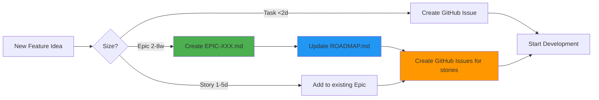
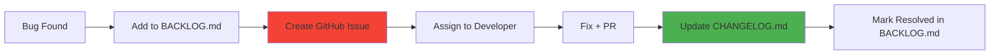
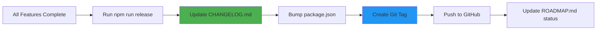
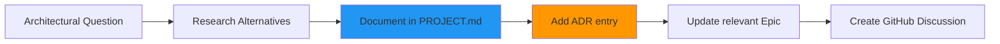

# 📚 Documentation Structure Guide

> **Purpose**: This document explains the complete documentation structure of CollaborNest, where to find information, what to update, and when to create new files.

**Last Updated**: November 16, 2025
**Maintainer**: Development Team

---

## 🗺️ Documentation Map

```
collabornest/
├── README.md                      ← 📍 START HERE (project overview)
├── CONTRIBUTING.md                ← How to contribute
├── CHANGELOG.md                   ← Version history
├── LICENSE                        ← MIT License
├── CODE_OF_CONDUCT.md            ← Community guidelines
├── SECURITY.md                    ← Security policy
│
├── .github/
│   ├── copilot-instructions.md   ← AI agent guidelines
│   └── ISSUE_TEMPLATE/           ← GitHub issue templates
│       ├── bug_report.md
│       ├── feature_request.md
│       └── task.md
│
└── docs/
    ├── DOCUMENTATION_GUIDE.md    ← 📍 YOU ARE HERE
    ├── QUICKSTART.md             ← 15-minute tutorial
    ├── PROJECT.md                ← 📖 COMPLETE SPECIFICATION (2000+ lines)
    │                                 - Architecture diagrams
    │                                 - BDD scenarios
    │                                 - ADR (Architectural Decision Records)
    │
    └── project/
        ├── ROADMAP.md            ← Development timeline (Q1-Q4 2026)
        ├── BACKLOG.md            ← Bugs, improvements, future work
        ├── EPIC-001-websocket-gateway.md      ← Backend Epic (Weeks 1-8)
        ├── EPIC-002-collaboration-widget.md   ← Frontend Epic (Weeks 9-13)
        └── EPIC-003-production-infra.md       ← DevOps Epic (Weeks 14-16)
```

---

## 📖 Document Purposes

### Root Level (Repository Home)

| File                   | When to Read                 | When to Update                     | Audience             |
| ---------------------- | ---------------------------- | ---------------------------------- | -------------------- |
| **README.md**          | First visit to project       | New features, version bump, badges | Everyone             |
| **CONTRIBUTING.md**    | Before first contribution    | Workflow changes, new tools        | Contributors         |
| **CHANGELOG.md**       | Before release, after update | Every release (automated)          | Users, contributors  |
| **LICENSE**            | Legal questions              | Never (unless license change)      | Legal, users         |
| **CODE_OF_CONDUCT.md** | Community issues             | Rarely (major policy changes)      | Community            |
| **SECURITY.md**        | Security concerns            | New vulnerability process          | Security researchers |

### .github/ Directory

| File                        | When to Read              | When to Update            | Audience              |
| --------------------------- | ------------------------- | ------------------------- | --------------------- |
| **copilot-instructions.md** | AI pair programming setup | New conventions, patterns | AI agents, developers |
| **ISSUE_TEMPLATE/\*.md**    | Creating GitHub issue     | New issue types needed    | Contributors          |

### docs/ Directory (User Documentation)

| File                       | When to Read                | When to Update                | Audience               |
| -------------------------- | --------------------------- | ----------------------------- | ---------------------- |
| **QUICKSTART.md**          | Getting started (15 min)    | Breaking changes in setup     | New users              |
| **PROJECT.md**             | Deep architecture dive      | Major architectural decisions | Tech leads, architects |
| **DOCUMENTATION_GUIDE.md** | Understanding doc structure | New docs added/removed        | Maintainers            |

### docs/project/ Directory (Development Planning)

| File            | When to Read                      | When to Update                  | Audience                       |
| --------------- | --------------------------------- | ------------------------------- | ------------------------------ |
| **ROADMAP.md**  | Sprint planning, quarterly review | Milestone changes, new quarters | Product managers, contributors |
| **BACKLOG.md**  | Daily development, bug triage     | New bugs, resolved issues       | Developers                     |
| **EPIC-XXX.md** | Starting work on epic             | Story completion, new stories   | Epic assignees                 |

---

## 🎯 When to Create New Documents

### ✅ Create New File When

| Scenario                   | File Type        | Location         | Example                              |
| -------------------------- | ---------------- | ---------------- | ------------------------------------ |
| New Epic (2-8 weeks work)  | `EPIC-XXX.md`    | `docs/project/`  | `EPIC-004-analytics.md`              |
| Major feature architecture | `FEATURE-XXX.md` | `docs/`          | `docs/MULTI_TENANCY.md`              |
| Operational runbook        | `runbook-xxx.md` | `docs/runbooks/` | `docs/runbooks/disaster-recovery.md` |
| API documentation          | `API.md`         | `docs/`          | `docs/API.md`                        |
| Deployment guide           | `DEPLOYMENT.md`  | `docs/`          | `docs/DEPLOYMENT.md`                 |

### ❌ DON'T Create New File When

| Scenario          | What to Do Instead                           |
| ----------------- | -------------------------------------------- |
| Small bug fix     | Add to `BACKLOG.md` → create GitHub Issue    |
| Minor improvement | Add to `BACKLOG.md` → create GitHub Issue    |
| Task (< 2 days)   | Create GitHub Issue using `task.md` template |
| Temporary notes   | Use `docs/dev/` (gitignored)                 |
| Release notes     | Update `CHANGELOG.md`                        |

---

## 🔄 Update Workflows

### Scenario 1: Adding a New Feature



**Files to Update**:

1. **ROADMAP.md** - Add milestone and timeline
2. **EPIC-XXX.md** - Create new epic file (if epic-sized)
3. **GitHub Issues** - Create issues for each story/task
4. **BACKLOG.md** - Add epic reference in "Epic References" section

### Scenario 2: Fixing a Bug



**Files to Update**:

1. **BACKLOG.md** - Add bug entry (BUG-XXX)
2. **GitHub Issue** - Create using `bug_report.md` template
3. **CHANGELOG.md** - Add to `[Unreleased]` section (after fix)
4. **BACKLOG.md** - Mark as RESOLVED (after release)

### Scenario 3: Releasing a New Version



**Files to Update**:

1. **CHANGELOG.md** - Move `[Unreleased]` to `[vX.Y.Z]` (automated)
2. **package.json** - Version bump (automated)
3. **ROADMAP.md** - Update milestone status
4. **BACKLOG.md** - Mark completed items as RESOLVED

### Scenario 4: Architectural Decision



**Files to Update**:

1. **PROJECT.md** - Add to ADR section (Appendix)
2. **EPIC-XXX.md** - Update architecture diagram if needed
3. **GitHub Discussion** - Create for team feedback
4. **CONTRIBUTING.md** - Update if affects workflow

---

## 🧭 Navigation by Role

### I am a... → I should read

| Role                    | Primary Documents                                         | Secondary Documents       |
| ----------------------- | --------------------------------------------------------- | ------------------------- |
| **New User**            | README.md → QUICKSTART.md                                 | PROJECT.md (Sections 1-2) |
| **New Contributor**     | CONTRIBUTING.md → ROADMAP.md → GitHub Issues              | EPIC-XXX.md for context   |
| **Backend Developer**   | EPIC-001-websocket-gateway.md → PROJECT.md (Section 3)    | BACKLOG.md for tasks      |
| **Frontend Developer**  | EPIC-002-collaboration-widget.md → PROJECT.md (Section 4) | BACKLOG.md for tasks      |
| **DevOps Engineer**     | EPIC-003-production-infra.md → PROJECT.md (Section 5)     | ROADMAP.md for timeline   |
| **Product Manager**     | ROADMAP.md → BACKLOG.md → PROJECT.md (Section 1)          | CHANGELOG.md for history  |
| **Security Researcher** | SECURITY.md → PROJECT.md (Security sections)              | GitHub Security tab       |
| **Tech Lead/Architect** | PROJECT.md (complete) → EPIC-XXX.md → ADR                 | All documentation         |

---

## 📏 Documentation Standards

### File Naming Conventions

```
UPPERCASE.md          → Root-level standard files (README, CONTRIBUTING, etc.)
lowercase-dash.md     → General documentation (quickstart.md, api.md)
EPIC-NNN-name.md      → Epic files (EPIC-001-websocket-gateway.md)
STORY-NNN-name.md     → Story files (if created, rare)
TASK-NNN-name.md      → Task files (if created, very rare)
```

### Content Structure (Markdown)

All documentation files should include:

```markdown
# Document Title

> **Purpose**: Brief description
> **Last Updated**: YYYY-MM-DD
> **Maintainer**: Role/Name

---

## Section 1

Content...

---

**Footer with metadata**
```

### Diagrams

- **Use Mermaid** for architecture, flow, sequence diagrams
- **Keep in PROJECT.md or EPIC-XXX.md** (not separate files)
- **Version diagrams** (add version number to diagram title if it changes)

### BDD Scenarios

- **Use Gherkin syntax** (Feature, Scenario, Given/When/Then)
- **Keep in PROJECT.md or EPIC-XXX.md** (not separate files)
- **Link to test files** when implemented

---

## 🔍 Quick Reference: "Where Do I Find...?"

| Question                         | Answer                                            |
| -------------------------------- | ------------------------------------------------- |
| **Project overview?**            | `README.md`                                       |
| **How to contribute?**           | `CONTRIBUTING.md`                                 |
| **Complete architecture?**       | `docs/PROJECT.md`                                 |
| **Development timeline?**        | `docs/project/ROADMAP.md`                         |
| **Current bugs/improvements?**   | `docs/project/BACKLOG.md`                         |
| **Epic details (BE-001)?**       | `docs/project/EPIC-001-websocket-gateway.md`      |
| **BDD scenarios for feature X?** | `docs/PROJECT.md` or `docs/project/EPIC-XXX.md`   |
| **Architectural decisions?**     | `docs/PROJECT.md` (Appendix: ADR)                 |
| **Version history?**             | `CHANGELOG.md`                                    |
| **Security policy?**             | `SECURITY.md`                                     |
| **How to report a bug?**         | `.github/ISSUE_TEMPLATE/bug_report.md`            |
| **How to pick a task?**          | `CONTRIBUTING.md` (Section: "How to Pick a Task") |
| **15-minute tutorial?**          | `docs/QUICKSTART.md`                              |

---

## 🛠️ Maintenance Schedule

| Document            | Update Frequency              | Responsible      |
| ------------------- | ----------------------------- | ---------------- |
| **README.md**       | Every release                 | Tech Lead        |
| **CHANGELOG.md**    | Every release (automated)     | Release Manager  |
| **ROADMAP.md**      | Quarterly + milestone changes | Product Manager  |
| **BACKLOG.md**      | Weekly (bug triage)           | Development Team |
| **EPIC-XXX.md**     | Sprint start/end              | Epic Owner       |
| **PROJECT.md**      | Major architecture changes    | Architect        |
| **CONTRIBUTING.md** | Workflow changes              | Tech Lead        |
| **SECURITY.md**     | Policy changes                | Security Lead    |

---

## 📞 Questions About Documentation?

- **Missing documentation?** Open issue with label `documentation`
- **Unclear section?** Comment on relevant file via GitHub
- **Proposed structure change?** Create GitHub Discussion
- **Urgent documentation bug?** Contact maintainer: <aqwesome.cit.dev@gmail.com>

---

**Remember**: Good documentation is a living artifact. Update it as the project evolves! 🚀
