# 📚 DOCUMENTO UNICO - Real-Time Collaboration System for Healthcare

> **📍 Navigation**: This is the complete technical specification. For document structure overview, see **[DOCUMENTATION_GUIDE.md](./DOCUMENTATION_GUIDE.md)**.
> **Quick Links**: [ROADMAP](./project/ROADMAP.md) | [Epic BE-001](./project/EPIC-001-websocket-gateway.md) | [Epic FE-001](./project/EPIC-002-collaboration-widget.md) | [Epic DEVOPS-001](./project/EPIC-003-production-infra.md)

---

## 📋 INDICE

1. [Executive Summary](#1-executive-summary)
2. [Architettura di Sistema](#2-architettura-di-sistema)
3. [Backend - WebSocket Gateway](#3-backend---websocket-gateway)
4. [Frontend - Collaboration Widget](#4-frontend---collaboration-widget)
5. [DevOps - Infrastructure & Operations](#5-devops---infrastructure--operations)
6. [Roadmap Integrata](#6-roadmap-integrata)
7. [Success Criteria & KPIs](#7-success-criteria--kpis)

---

## 1. EXECUTIVE SUMMARY

### 1.1 Vision

Trasformare qualsiasi applicazione web sanitaria esistente in un sistema collaborativo real-time **senza modificarne il codice sorgente**, attraverso un widget JavaScript che abilita:

- ✅ **Editing collaborativo** - Google Docs-style con Y.js CRDT
- ✅ **Gestione lock** - Prevenzione conflitti su risorse critiche
- ✅ **Presenza real-time** - Visualizzazione utenti attivi
- ✅ **Offline-first** - Sincronizzazione automatica al riconnect
- ✅ **Audit completo** - Tracciabilità GDPR-compliant

### 1.2 Architettura High-Level

```mermaid
graph TB
    subgraph "Client Layer"
        APP[Existing Healthcare App<br/>NO CODE CHANGES]
        WIDGET[Collaboration Widget<br/>2 lines of code]
    end

    subgraph "Edge Layer"
        CDN[CDN<br/>Widget Distribution]
        LB[Load Balancer<br/>SSL Termination]
    end

    subgraph "Application Layer"
        GW1[Gateway Instance 1<br/>WebSocket + Y.js]
        GW2[Gateway Instance 2<br/>WebSocket + Y.js]
        GWN[Gateway Instance N<br/>WebSocket + Y.js]
    end

    subgraph "Data Layer"
        REDIS[(Redis<br/>Sessions, Locks, Cache)]
        RMQ[RabbitMQ<br/>Inter-Instance Pub/Sub]
        PG[(PostgreSQL<br/>Audit Trail + Events)]
    end

    subgraph "Observability"
        PROM[Prometheus<br/>Metrics]
        GRAF[Grafana<br/>Dashboards]
        LOGS[NDJSON Logs<br/>→ Elasticsearch]
    end

    APP -->|Load Widget| CDN
    WIDGET -->|WSS| LB

    LB --> GW1 & GW2 & GWN

    GW1 & GW2 & GWN <--> REDIS
    GW1 & GW2 & GWN <--> RMQ
    GW1 & GW2 & GWN --> PG

    GW1 & GW2 & GWN --> PROM
    PROM --> GRAF
    GW1 & GW2 & GWN --> LOGS

    style WIDGET fill:#4caf50
    style GW1 fill:#2196f3
    style REDIS fill:#ff6b6b
    style RMQ fill:#feca57
    style LOGS fill:#9c27b0
```



### 1.3 Key Metrics

```
┌────────────────────────┬──────────────┬──────────────┐
│ Metric                 │ Target       │ Criticality  │
├────────────────────────┼──────────────┼──────────────┤
│ Latency P99            │ < 200ms      │ ⭐⭐⭐⭐⭐   │
│ Uptime                 │ > 99.5%      │ ⭐⭐⭐⭐⭐   │
│ Max Concurrent Users   │ 500+         │ ⭐⭐⭐⭐     │
│ Message Delivery       │ > 99.9%      │ ⭐⭐⭐⭐⭐   │
│ Widget Load Time       │ < 500ms      │ ⭐⭐⭐⭐     │
│ Data Loss Events       │ 0            │ ⭐⭐⭐⭐⭐   │
│ Time to Integration    │ < 5 minutes  │ ⭐⭐⭐⭐⭐   │
└────────────────────────┴──────────────┴──────────────┘
```

---

## 2. ARCHITETTURA DI SISTEMA

### 2.1 Component Interaction Flow


### 2.2 Data Flow Architecture


### 2.3 Scelte Architetturali Chiave

```yaml
# ============================================================================
# DECISIONI ARCHITETTURALI FONDAMENTALI
# ============================================================================

widget_injection:
  scelta: JavaScript Widget via CDN
  alternative_considerate:
    - Browser Extension (scartata: solo desktop)
    - Proxy Layer (scartata: troppo complesso)
  motivazione: |
    - Zero modifiche all'app esistente (2 righe HTML)
    - Funziona su web + mobile
    - Distribuzione rapida via CDN
    - Update senza downtime

crdt_implementation:
  scelta: Y.js
  alternative_considerate:
    - Automerge (scartata: bundle size)
    - ShareDB OT (scartata: server-centric)
  motivazione: |
    - Performance 6M ops/sec
    - Offline-first nativo
    - Bundle size ridotto (~50KB)
    - Conflict-free garantito

websocket_server:
  scelta: Socket.IO
  alternative_considerate:
    - Native WebSocket (scartata: no fallback)
    - SignalR (scartata: .NET-centric)
  motivazione: |
    - Auto-reconnection
    - Fallback HTTP long-polling
    - Room management built-in
    - Battle-tested (Trello, Microsoft)

message_broker:
  scelta: RabbitMQ
  alternative_considerate:
    - Kafka (scartata: overkill per questo volume)
    - Redis Pub/Sub (scartata: no persistence)
  motivazione: |
    - Perfect fit per 100-10K msg/sec
    - Durable queues
    - Fanout pattern nativo
    - Operational simplicity

lock_mechanism:
  scelta: Redis SET NX (atomic)
  alternative_considerate:
    - Redlock multi-instance (future)
    - Database locks (scartata: too slow)
  motivazione: |
    - Sub-millisecond latency
    - Atomic operations garantite
    - TTL automatico
    - Retry logic semplice

presence_state:
  scelta: Redis Hashes + Sets (Week 4)
  alternative_considerate:
    - In-memory Map (current, single-instance only)
    - Redis Streams (scartata: overkill per state)
  motivazione: |
    - Enables multi-instance coordination (Kubernetes multi-pod)
    - TTL-based auto-cleanup (5min user, 10min room)
    - Atomic operations (SADD, HSET)
    - Graceful fallback to in-memory if Redis down
  implementation: |
    presence:user:{userId} → { socketId, lastSeen, rooms[] }
    presence:room:{roomId} → Set(userId1, userId2, ...)
    presence:socket:{socketId} → { userId, connectedAt }

circuit_breaker:
  scelta: Custom CircuitBreakerService (Week 4)
  alternative_considerate:
    - opossum library (scartata: overhead)
    - No circuit breaker (scartata: cascade failures)
  motivazione: |
    - Prevent cascade failures (Redis down → fallback in-memory)
    - Graceful degradation (continue serving with limited features)
    - Health check endpoint for Kubernetes liveness/readiness
    - Exponential backoff retry (1s, 2s, 4s, 8s, max 30s)
  states: |
    CLOSED (normal) → OPEN (failures ≥ threshold) → HALF_OPEN (retry after timeout)

external_integration:
  scelta: HTTP Webhook Receiver (Week 5)
  alternative_considerate:
    - Polling external API (scartata: latency + load)
    - gRPC streaming (scartata: complexity)
  motivazione: |
    - Push-based updates from EMR/PACS/HL7 feeds
    - Zero UI polling (event-driven architecture)
    - HMAC signature validation (security)
    - Broadcast to WebSocket clients in real-time
  flow: |
    External System → POST /api/webhooks/resource-updated
      → Validate HMAC → Query Redis rooms
        → Broadcast WebSocket event to subscribed clients
          → UI updates instantly (no polling)

logging_format:
  scelta: NDJSON (Newline Delimited JSON)
  alternative_considerate:
    - Plain text (scartata: no structure)
    - Protobuf (scartata: complexity)
  motivazione: |
    - Structured + human-readable
    - Stream processing friendly
    - Elasticsearch native support
    - Future-proof per analytics
```

---

## 3. BACKEND - WEBSOCKET GATEWAY

### 3.1 Architettura Backend


### 3.2 Epic Backend - User Stories

```yaml
# ============================================================================
# EPIC: BE-001 - Real-Time Collaboration Gateway
# ============================================================================
epic:
  id: BE-001
  title: 'WebSocket Gateway con Y.js CRDT'
  description: |
    Implementare gateway WebSocket scalabile per collaboration real-time
    in ambiente healthcare con Y.js per editing simultaneo conflict-free.

  duration: 8 settimane
  team: 2 backend developers

  stories:
    - BE-001.1: WebSocket Connection Management
    - BE-001.2: Presence Tracking & Resource Rooms
    - BE-001.3: Distributed Lock Management
    - BE-001.4: Y.js CRDT Integration
    - BE-001.5: RabbitMQ Cross-Instance Messaging
    - BE-001.6: Audit Trail & NDJSON Logging
    - BE-001.7: Dead Connection Detection
    - BE-001.8: Performance Optimization & Load Testing
```

### 3.3 User Stories Dettagliate

#### Story BE-001.1: WebSocket Connection Management

```gherkin
Feature: WebSocket Connection with JWT Authentication
  As a healthcare application user
  I want to establish a secure WebSocket connection
  So that I can collaborate in real-time with my team

  Background:
    Given the Gateway is running and healthy
    And Redis is available for session storage
    And PostgreSQL is available for audit logging

  Scenario: Successful connection with valid JWT
    Given I have a valid JWT token with claims:
      | claim  | value              |
      | userId | usr_12345          |
      | role   | surgeon            |
      | exp    | now + 24h          |
    When I connect to the WebSocket gateway with the token
    Then my connection should be accepted
    And I should receive a "CONNECTED" event with sessionId
    And my session should be stored in Redis with key "user:usr_12345:session"
    And the session should have TTL of 3600 seconds
    And an audit log should be written with eventType "USER_CONNECTED"

  Scenario: Connection rejected with invalid JWT
    Given I have an invalid JWT token
    When I connect to the WebSocket gateway
    Then my connection should be rejected
    And I should receive an "UNAUTHORIZED" error
    And no session should be created in Redis
    And an audit log should be written with eventType "CONNECTION_REJECTED"

  Scenario: Heartbeat mechanism keeps connection alive
    Given I am connected to the gateway
    And my session has TTL of 3600 seconds
    When I send a "HEARTBEAT" message
    Then the gateway should respond with "HEARTBEAT_ACK"
    And my session TTL should be reset to 3600 seconds
    And my activity timestamp should be updated in Redis

  Scenario: Connection timeout after missed heartbeats
    Given I am connected to the gateway
    And I stop sending heartbeat messages
    When 300 seconds have passed since last activity
    Then my activity key should expire in Redis
    And a cleanup job should detect the inactive session
    And my session should be removed
    And I should be removed from all resources
    And all my locks should be released

  Acceptance Criteria:
    - [ ] JWT validation with RS256 algorithm
    - [ ] Session creation in Redis with TTL
    - [ ] Heartbeat every 30 seconds
    - [ ] Auto-disconnect after 60s without ping/pong
    - [ ] Graceful disconnection cleanup
    - [ ] All events logged in NDJSON format
```

#### Story BE-001.2: Presence Tracking & Resource Rooms

```gherkin
Feature: User Presence and Resource Rooms
  As a healthcare application user
  I want to see who else is collaborating on the same page
  So that I can coordinate with my team

  Scenario: Join resource as editor
    Given I am connected to the gateway as user "usr_001"
    And the resource "page:/patient/12345" exists
    When I send a "JOIN_RESOURCE" event with:
      | field        | value                  |
      | resourceId   | page:/patient/12345    |
      | resourceType | patient_record         |
      | mode         | editor                 |
    Then I should join the resource successfully
    And I should receive "RESOURCE_STATE" with:
      | field    | value                                    |
      | users    | List of currently online users           |
      | state    | Current Y.js document state              |
      | revision | Current revision number                  |
    And I should be added to Redis set "resource:page:/patient/12345:users"
    And Redis hash "resource:page:/patient/12345:user:usr_001" should contain:
      | field     | value                  |
      | mode      | editor                 |
      | joinedAt  | current_timestamp      |
    And other users in the resource should receive "USER_JOINED" event
    And the event should be broadcasted via RabbitMQ

  Scenario: Join resource as viewer
    Given I am connected to the gateway
    And I have viewer permissions on resource "page:/patient/12345"
    When I join the resource as viewer
    Then I should see all content
    But I should not be able to send "RESOURCE_UPDATE" events
    And any update attempt should be rejected with "PERMISSION_DENIED"

  Scenario: Leave resource gracefully
    Given I am in resource "page:/patient/12345"
    When I send "LEAVE_RESOURCE" event
    Then I should be removed from the resource users list
    And other users should receive "USER_LEFT" event
    And my metadata should be deleted from Redis
    And any locks I hold on that resource should be released

  Scenario: Presence list updates in real-time
    Given I am in resource "page:/patient/12345"
    And there are 3 other users in the resource
    When a new user joins
    Then I should receive "USER_JOINED" event immediately
    And my presence list should show 5 total users
    When a user disconnects
    Then I should receive "USER_LEFT" event
    And my presence list should show 4 users

  Acceptance Criteria:
    - [ ] Join/leave resource functionality
    - [ ] Real-time presence updates via RabbitMQ
    - [ ] Support for editor/viewer modes
    - [ ] Permission validation on mode
    - [ ] Redis sets for user tracking
    - [ ] Multi-resource support (user can be in multiple rooms)
```

#### Story BE-001.3: Distributed Lock Management

```gherkin
Feature: Distributed Resource Locking
  As a surgeon using collaborative tools
  I want to lock a resource while I'm editing it
  So that others cannot make conflicting changes

  Scenario: Acquire lock on available resource
    Given I am connected as user "usr_001"
    And the resource "input-field-123" is not locked
    When I send "LOCK_ACQUIRE" event for "input-field-123"
    Then the gateway should execute Redis SET with NX flag:
      """
      SET lock:input-field-123 usr_001 EX 30 NX
      """
    And the command should return "OK"
    And I should receive "LOCK_ACQUIRED" event with:
      | field     | value                      |
      | lockId    | unique-lock-id             |
      | expiresAt | current_time + 30 seconds  |
    And metadata should be stored in Redis hash:
      """
      HSET lock:input-field-123:metadata
        lockType "exclusive"
        acquiredAt "timestamp"
        expiresAt "timestamp"
        userId "usr_001"
      """
    And other users should receive "LOCK_STATUS_CHANGED" event

  Scenario: Lock acquisition denied when already locked
    Given user "usr_002" holds lock on "input-field-123"
    When I attempt to acquire lock on "input-field-123"
    Then the Redis SET NX should return NULL
    And I should receive "LOCK_DENIED" event with:
      | field       | value                    |
      | reason      | already_locked           |
      | lockedBy    | usr_002                  |
      | lockedUntil | expiration_timestamp     |

  Scenario: Lock auto-extends while user is active
    Given I hold lock on "input-field-123"
    And the lock expires in 30 seconds
    When I am actively using the resource
    Then every 20 seconds the gateway should execute:
      """
      EXPIRE lock:input-field-123 30
      """
    And the lock should not expire while I'm active

  Scenario: Lock expires automatically after TTL
    Given I hold lock on "input-field-123"
    And I become inactive
    When 30 seconds pass without lock extension
    Then Redis should automatically delete the lock key
    And other users should receive "LOCK_RELEASED" event
    And the resource should become available for locking

  Scenario: Lock released on disconnection
    Given I hold locks on resources:
      | resourceId       |
      | input-field-123  |
      | input-field-456  |
    When I disconnect from the gateway
    Then the gateway should release all my locks:
      """
      DEL lock:input-field-123
      DEL lock:input-field-123:metadata
      DEL lock:input-field-456
      DEL lock:input-field-456:metadata
      """
    And "LOCK_RELEASED" events should be broadcasted
    And audit logs should record lock releases with reason "user_disconnected"

  Scenario: Race condition handling
    Given two users attempt to lock the same resource simultaneously
    When both send "LOCK_ACQUIRE" at t=0ms and t=2ms
    Then Redis atomic NX operation should ensure only one succeeds
    And the winner should receive "LOCK_ACQUIRED"
    And the loser should receive "LOCK_DENIED"
    And there should be no split-brain scenario

  Acceptance Criteria:
    - [ ] Atomic lock acquisition using Redis SET NX
    - [ ] TTL-based auto-expiration (default 30s)
    - [ ] Auto-extend mechanism for active users
    - [ ] Immediate release on disconnection
    - [ ] Race condition protection via atomic operations
    - [ ] Lock metadata tracking
    - [ ] Retry logic with exponential backoff
```

#### Story BE-001.4: Y.js CRDT Integration

```gherkin
Feature: Conflict-Free Replicated Data Type (CRDT) with Y.js
  As a healthcare professional
  I want to edit documents simultaneously with colleagues
  So that our changes merge automatically without conflicts

  Scenario: Initialize Y.js document for resource
    Given a user joins resource "page:/patient/12345"
    And no Y.js document exists for this resource
    When the gateway initializes the document
    Then a new Y.Doc should be created
    And a Y.Text named "content" should be created within the doc
    And the initial state should be persisted to PostgreSQL:
      """
      INSERT INTO yjs_states (resource_id, state, revision, updated_at)
      VALUES ('page:/patient/12345', <binary_state>, 1, NOW())
      """

  Scenario: Apply Y.js update from client
    Given I am editing resource "page:/patient/12345"
    And the Y.js document exists with content "Patient stable"
    When I type " and recovering" in my widget
    Then the widget generates a Y.js update (binary)
    And sends "Y_UPDATE" event to gateway with:
      | field      | value                    |
      | resourceId | page:/patient/12345      |
      | update     | [binary_update_array]    |
    And the gateway should:
      """
      1. Get Y.Doc for resource
      2. Apply update: Y.applyUpdate(ydoc, update)
      3. Persist state to PostgreSQL
      4. Broadcast update via RabbitMQ
      """
    And other connected clients should receive the update
    And apply it to their local Y.Docs
    And see "Patient stable and recovering"

  Scenario: Simultaneous edits merge conflict-free
    Given two users are editing the same document
    And the document contains "Initial text"
    When User A types " - modified by A" at position 12
    And User B types " - modified by B" at position 12
    And both updates reach the gateway within 50ms
    Then both updates should be applied to Y.Doc
    And Y.js CRDT algorithm should merge them deterministically
    And the final text should be: "Initial text - modified by A - modified by B"
    And the merge order should be consistent across all clients
    And no conflict errors should occur

  Scenario: Offline editing and sync
    Given I am editing a document
    And my widget has Y.js running locally
    When my internet connection drops
    Then I continue editing offline
    And changes are stored in local Y.Doc
    When my connection is restored
    Then the widget reconnects to gateway
    And sends accumulated Y.js updates
    And the gateway applies all updates
    And sends back any updates I missed
    And my Y.Doc merges with remote state
    And I see the complete synchronized document

  Scenario: Y.js state persistence and recovery
    Given a Y.js document has been edited extensively
    And the state is persisted to PostgreSQL every 5 seconds
    When the gateway restarts
    Then on first user join, gateway should:
      """
      1. Query PostgreSQL for latest state
      2. Load state: Y.applyUpdate(ydoc, stored_state)
      3. Send state to joining client
      """
    And the client should see the complete document
    And editing should continue seamlessly

  Acceptance Criteria:
    - [ ] Y.js CRDT implementation
    - [ ] Binary update encoding/decoding
    - [ ] Conflict-free merge guarantee
    - [ ] Offline editing support
    - [ ] State persistence to PostgreSQL
    - [ ] State recovery on gateway restart
    - [ ] Performance: < 50ms update application
    - [ ] Performance: 6M+ operations/second capability
```

### 3.4 Backend BDD Scenarios - Critical Paths

```gherkin
# ============================================================================
# CRITICAL PATH 1: Connection Lifecycle
# ============================================================================
Feature: Complete WebSocket Connection Lifecycle

  Scenario: End-to-end connection flow
    Given the gateway cluster is running with 3 instances
    And Redis is healthy
    And RabbitMQ is healthy
    And PostgreSQL is healthy
    When a new client connects with valid JWT
    Then the connection should complete in < 500ms
    And session should be created in Redis
    And heartbeat should start automatically
    And the client should be ready for collaboration

    When the client joins 2 resources
    Then presence should be updated in < 100ms
    And other users should be notified in < 200ms

    When the client edits a document
    Then updates should propagate in < 50ms
    And all connected clients should receive updates

    When the client acquires a lock
    Then lock should be acquired in < 100ms
    And other clients should see lock status

    When the client disconnects gracefully
    Then cleanup should complete in < 500ms
    And all resources should be cleaned
    And all locks should be released
    And other users should be notified

# ============================================================================
# CRITICAL PATH 2: Failure Scenarios
# ============================================================================
Feature: Resilience to Failures

  Scenario: Redis temporary unavailability
    Given a client is connected and editing
    When Redis becomes unavailable for 5 seconds
    Then the gateway should buffer operations in memory
    And client should continue editing (degraded mode)
    When Redis becomes available again
    Then buffered operations should be flushed
    And normal operations should resume
    And no data should be lost

  Scenario: Gateway instance crash
    Given 100 clients connected across 3 gateway instances
    And Instance-1 has 30 clients
    When Instance-1 crashes unexpectedly
    Then clients on Instance-1 should detect disconnect in < 60s
    And clients should auto-reconnect to Instance-2 or Instance-3
    And sessions should be restored from Redis
    And collaboration should resume
    And total downtime per client should be < 120s

  Scenario: Network partition between gateway and Redis
    Given normal operations are running
    When network partition occurs between gateway and Redis
    Then gateway should detect failure in < 5s
    And health check should report degraded
    And new connections should be rejected
    And existing connections should gracefully disconnect
    When partition is healed
    Then gateway should reconnect to Redis
    And health check should report healthy
    And new connections should be accepted

# ============================================================================
# CRITICAL PATH 3: Race Conditions
# ============================================================================
Feature: Concurrent Operations Handling

  Scenario: Multiple users acquire same lock simultaneously
    Given 5 users are connected
    And all users attempt to lock "resource-X" at the same time
    When all LOCK_ACQUIRE messages arrive within 10ms window
    Then only 1 user should acquire the lock (Redis NX atomic)
    And the other 4 should receive LOCK_DENIED
    And no split-brain should occur
    And all users should have consistent view

  Scenario: Simultaneous Y.js updates
    Given 10 users editing same document
    When all users type simultaneously at different positions
    Then all updates should be processed
    And Y.js CRDT should merge all changes
    And final state should be deterministic
    And all clients should converge to same state in < 500ms

# ============================================================================
# CRITICAL PATH 4: Load & Performance
# ============================================================================
Feature: Performance Under Load

  Scenario: 500 concurrent connections
    Given gateway cluster with 3 instances
    When 500 clients connect over 60 seconds
    Then all connections should succeed
    And P99 connection latency should be < 500ms
    And P99 message latency should be < 200ms
    And CPU usage should be < 70%
    And memory usage should be < 2GB per instance
    And no errors should occur

  Scenario: 10,000 messages per second
    Given 100 active clients
    When each client sends 100 messages per second
    Then total throughput should be 10,000 msg/sec
    And P99 delivery latency should be < 200ms
    And message loss should be 0%
    And Redis operations should be < 5ms
    And RabbitMQ should handle load without queue buildup
```

---

## 4. FRONTEND - COLLABORATION WIDGET

### 4.1 Architettura Frontend

```mermaid
graph TB
    subgraph "Existing Application"
        APP[Healthcare App HTML]
        INPUTS[Native Input Elements]
    end

    subgraph "Collaboration Widget"
        SDK_CORE[SDK Core<br/>Auto-Discovery]

        subgraph "Detection Engine"
            SCANNER[DOM Scanner<br/>MutationObserver]
            ID_GEN[ID Generator<br/>Stable IDs]
            BINDER[Two-way Binder<br/>DOM ↔ Y.js]
        end

        subgraph "Collaboration Layer"
            YLOCAL[Y.js Local Doc]
            WS_CLIENT[WebSocket Client<br/>Socket.IO]
            STATE[State Manager<br/>Users, Locks]
        end

        subgraph "UI Components"
            OVERLAY[Overlay Panel]
            BADGES[Input Badges]
            PRESENCE[Presence Indicators]
            LOCK_UI[Lock Status UI]
        end
    end

    APP --> INPUTS
    SDK_CORE --> SCANNER
    SCANNER -->|Discover| INPUTS
    SCANNER --> ID_GEN
    ID_GEN --> BINDER
    BINDER <--> INPUTS
    BINDER <--> YLOCAL

    YLOCAL <--> WS_CLIENT
    WS_CLIENT <--> STATE

    STATE --> OVERLAY
    STATE --> BADGES
    STATE --> PRESENCE
    STATE --> LOCK_UI

    style SDK_CORE fill:#4caf50
    style YLOCAL fill:#2196f3
    style OVERLAY fill:#ff9800
```



### 4.2 Epic Frontend - User Stories

```yaml
# ============================================================================
# EPIC: FE-001 - Collaboration Widget SDK
# ============================================================================
epic:
  id: FE-001
  title: 'JavaScript Widget for Zero-Code Integration'
  description: |
    Sviluppare widget JavaScript che trasforma qualsiasi app web in sistema
    collaborativo senza modifiche al codice esistente (solo 2 righe HTML).

  duration: 5 settimane
  team: 1 frontend developer

  stories:
    - FE-001.1: Widget Core & Auto-Discovery
    - FE-001.2: Y.js Client Integration
    - FE-001.3: WebSocket Connection Manager
    - FE-001.4: Lock Management UI
    - FE-001.5: Overlay Components
    - FE-001.6: Bundle Optimization & CDN
```

### 4.3 Frontend BDD Scenarios

```gherkin
# ============================================================================
# FEATURE: Widget Auto-Discovery
# ============================================================================
Feature: Automatic Input Field Detection and Binding
  As a developer
  I want the widget to automatically find all input fields
  So that I don't need to manually specify them

  Background:
    Given an HTML page with various input elements:
      """
      <input type="text" id="patient-name">
      <textarea id="notes"></textarea>
      <input type="email" name="doctor-email">
      <input type="password" id="password">
      """
    And the CollabSDK is loaded with config:
      """
      CollabSDK.init({
        gatewayUrl: 'wss://gateway.example.com',
        token: 'valid-jwt-token',
        autoDiscovery: true,
      });
      """

  Scenario: Discover text inputs and textareas
    When the widget initializes
    Then it should discover:
      | element           | type     |
      | #patient-name     | input    |
      | #notes            | textarea |
      | [name=doctor-email] | input  |
    And it should NOT discover:
      | element    | reason              |
      | #password  | type=password       |

  Scenario: Generate stable unique IDs
    Given input element with id="patient-name"
    When the widget generates ID
    Then ID should be "id-patient-name"
    And ID should be stable across page reloads

    Given input element without id but with name="doctor-email"
    When the widget generates ID
    Then ID should be "name-doctor-email"

    Given input without id or name but placeholder="Enter notes"
    When the widget generates ID
    Then ID should be "placeholder-<hash>"
    And hash should be deterministic from placeholder text

  Scenario: Apply Y.js binding to discovered inputs
    Given input #patient-name is discovered
    When the widget binds it to Y.js
    Then a Y.Text should be created with key "id-patient-name"
    And DOM changes should sync to Y.js
    And Y.js changes should sync to DOM
    And cursor position should be preserved during sync

  Scenario: Detect dynamically added inputs
    Given the page loads with 3 inputs
    And the widget has discovered them
    When JavaScript dynamically adds a new input:
      """
      const input = document.createElement('input');
      input.id = 'dynamic-field';
      document.body.appendChild(input);
      """
    Then the widget should detect it within 100ms
    And automatically bind it to Y.js
    And it should be available for collaboration

  Scenario: Handle input removal
    Given an input is bound to Y.js
    When the input is removed from DOM
    Then the widget should clean up the binding
    And Y.js text should be preserved (not deleted)
    And if input is re-added, it should restore state

  Acceptance Criteria:
    - [ ] Auto-discover text inputs and textareas
    - [ ] Generate stable IDs (id > name > placeholder > position)
    - [ ] MutationObserver for dynamic inputs
    - [ ] Two-way binding DOM ↔ Y.js
    - [ ] Cursor position preservation
    - [ ] Cleanup on element removal

# ============================================================================
# FEATURE: Real-time Collaboration UI
# ============================================================================
Feature: Visual Feedback for Collaboration

  Scenario: Visual indicator on collaborative inputs
    Given an input is bound for collaboration
    When the widget activates it
    Then the input should have:
      | visual element         | description                      |
      | Green border           | 2px solid #4caf50                |
      | Glow shadow            | 0 0 8px rgba(76, 175, 80, 0.3)   |
      | Badge icon             | 👥 at top-right corner           |
      | Tooltip                | "Collaborative field: <id>"      |

  Scenario: Flash on remote update
    Given I am viewing an input
    And another user types in the same field
    When I receive the Y.js update
    Then the input should flash green for 800ms
    And the background should animate from transparent to light green
    And I should see the updated text immediately

  Scenario: Lock status visualization
    Given an input field is lockable
    When I acquire the lock
    Then the input should show:
      | indicator    | state                          |
      | Border       | Yellow (#ff9800)               |
      | Badge        | 🔒 instead of 👥               |
      | Cursor       | Normal editing cursor          |

    When another user has the lock
    Then my input should show:
      | indicator    | state                          |
      | Border       | Red (#f44336)                  |
      | Badge        | 🔒 with other user's name      |
      | Cursor       | Not-allowed cursor             |
      | Input state  | Readonly                       |

  Scenario: Overlay panel interaction
    Given the widget is initialized
    When the page loads
    Then an overlay panel should appear at bottom-right
    And should display:
      | section         | content                        |
      | Connection      | Status dot (green = connected) |
      | Users           | Count of online users          |
      | Active fields   | Count of collaborative inputs  |

    When I click the minimize button
    Then the panel should collapse
    And only show a small floating icon

    When I click the floating icon
    Then the panel should expand again

  Scenario: Presence avatars on focused input
    Given multiple users are in the same resource
    When another user focuses on an input
    Then I should see a small avatar next to that input
    And the avatar should show the user's initials
    And hover should show full name and role
    When the user unfocuses
    Then the avatar should disappear with fade animation

  Acceptance Criteria:
    - [ ] Green border on collaborative inputs
    - [ ] Badge indicators (👥, 🔒)
    - [ ] Flash animation on updates
    - [ ] Lock status visualization
    - [ ] Overlay panel with stats
    - [ ] Presence avatars
    - [ ] Smooth animations (CSS transitions)

# ============================================================================
# FEATURE: Offline Support
# ============================================================================
Feature: Offline Editing and Synchronization

  Scenario: Continue editing while offline
    Given I am editing a collaborative document
    And I am connected to the gateway
    When my internet connection drops
    Then the widget should detect disconnection within 60s
    And show "Offline" status in overlay
    But I should still be able to type
    And changes should be stored in local Y.Doc
    And UI should indicate offline mode (orange border)

  Scenario: Automatic sync when reconnected
    Given I edited offline and have 10 pending updates
    When my connection is restored
    Then the widget should reconnect automatically
    And send all accumulated Y.js updates
    And receive any updates from other users
    And merge them conflict-free
    And show "Syncing..." status
    And show "Synced" when complete
    And UI should return to normal (green border)

  Scenario: Conflict-free merge after offline period
    Given I go offline at t=0
    And I type "Offline changes"
    And another user types "Online changes" at t=30s
    When I reconnect at t=60s
    Then Y.js should merge both changes deterministically
    And I should see both texts in the final document
    And no data should be lost
    And no conflict errors should occur

  Acceptance Criteria:
    - [ ] Offline detection (connection status monitoring)
    - [ ] Local Y.Doc persistence while offline
    - [ ] Auto-reconnect on connection restore
    - [ ] Batch update sync on reconnect
    - [ ] Conflict-free merge (Y.js CRDT)
    - [ ] Visual feedback (offline/syncing/synced states)
```

### 4.4 Widget Integration Flow


---

## 5. DEVOPS - INFRASTRUCTURE & OPERATIONS

### 5.1 Infrastructure Architecture


### 5.2 CI/CD Pipeline


### 5.3 Deployment Strategies

```yaml
# ============================================================================
# DEPLOYMENT STRATEGY: Blue-Green
# ============================================================================
blue_green_deployment:
  description: |
    Deploy new version to "green" environment while "blue" serves traffic.
    Switch traffic only after health checks pass.

  steps:
    1_current_state:
      - Blue environment: v1.2.3 (100% traffic)
      - Green environment: idle

    2_deploy_green:
      - Deploy v1.3.0 to Green
      - Run health checks
      - Run smoke tests
      - No customer traffic yet

    3_switch_traffic:
      - Update ALB target group
      - Route 100% traffic to Green
      - Blue becomes standby
      - Monitor for 15 minutes

    4_rollback_if_needed:
      - If errors spike: Switch back to Blue instantly
      - If all OK: Decommission Blue after 24h

  pros:
    - Zero downtime
    - Instant rollback capability
    - Full production environment testing

  cons:
    - Requires 2x infrastructure during deploy
    - Database migrations require careful planning

  healthcare_fit: ⭐⭐⭐⭐⭐ (Best for critical systems)

# ============================================================================
# DEPLOYMENT STRATEGY: Rolling Update
# ============================================================================
rolling_update:
  description: |
    Update instances one at a time while maintaining service availability.

  steps:
    1_initial_state:
      - 3 instances running v1.2.3
      - All serving traffic

    2_update_instance_1:
      - Stop instance-1
      - Deploy v1.3.0
      - Health check
      - Add back to load balancer
      - Monitor for 5 minutes

    3_update_instance_2:
      - Repeat for instance-2
      - Monitor

    4_update_instance_3:
      - Repeat for instance-3
      - All instances now v1.3.0

  pros:
    - No extra infrastructure needed
    - Gradual rollout reduces risk

  cons:
    - Slower deployment (30-45 minutes)
    - Mixed version traffic during deploy
    - Complex rollback (must redeploy old version)

  healthcare_fit: ⭐⭐⭐ (OK for non-critical updates)

# ============================================================================
# CHOSEN STRATEGY: Blue-Green with Canary
# ============================================================================
chosen_strategy:
  primary: Blue-Green
  enhancement: Canary Testing

  workflow:
    1: Deploy to Green environment
    2: Route 5% traffic to Green (canary)
    3: Monitor for 30 minutes
    4: If OK, route 50% traffic
    5: Monitor for 30 minutes
    6: If OK, route 100% traffic
    7: Keep Blue as standby for 24h
```

### 5.4 Monitoring Strategy


### 5.5 DevOps BDD Scenarios

```gherkin
# ============================================================================
# FEATURE: CI/CD Pipeline
# ============================================================================
Feature: Continuous Integration and Deployment

  Scenario: Successful build and deploy to staging
    Given a developer pushes code to main branch
    And all tests pass locally
    When GitHub Actions triggers
    Then the pipeline should:
      | step              | duration | success_criteria           |
      | Checkout code     | < 30s    | Git clone successful       |
      | Install deps      | < 2min   | npm install exits 0        |
      | Lint              | < 1min   | ESLint 0 errors            |
      | Unit tests        | < 3min   | Jest 100% pass             |
      | Build             | < 2min   | TypeScript compile success |
      | Security scan     | < 3min   | npm audit 0 critical       |
      | Build Docker      | < 5min   | Image built successfully   |
      | Push to ECR       | < 2min   | Image pushed & tagged      |
      | Deploy to staging | < 5min   | ECS tasks running          |
      | Smoke tests       | < 2min   | Health check returns 200   |
    And total pipeline duration should be < 30 minutes
    And Slack notification should be sent

  Scenario: Build fails on failing tests
    Given a developer pushes code with failing unit test
    When GitHub Actions triggers
    Then the build should fail at test stage
    And no Docker image should be built
    And no deployment should occur
    And developer should receive failure notification
    And PR should show red status

  Scenario: Production deployment with approval
    Given staging deployment succeeded
    And integration tests passed
    When deployment manager clicks "Deploy to Production"
    Then manual approval should be required
    And approval should timeout after 24 hours
    When approval is granted
    Then blue-green deployment should start
    And traffic should switch after health checks pass

  Scenario: Automatic rollback on failure
    Given production deployment completed
    And new version is serving 100% traffic
    When error rate exceeds 5% for 5 minutes
    Then automatic rollback should trigger
    And traffic should switch to previous version
    And incident should be created in PagerDuty
    And deployment should be marked as failed

# ============================================================================
# FEATURE: Infrastructure Monitoring
# ============================================================================
Feature: System Health Monitoring and Alerting

  Scenario: Normal operations monitoring
    Given all services are healthy
    When monitoring systems collect metrics
    Then Prometheus should scrape metrics every 15 seconds
    And CloudWatch should receive metrics every 60 seconds
    And Grafana should display real-time dashboards
    And no alerts should fire

  Scenario: High CPU usage alert
    Given average CPU usage is 40%
    When CPU usage exceeds 80% for 5 minutes
    Then an alert should fire to PagerDuty
    And Slack notification should be sent
    And alert should include:
      | field       | value                        |
      | Severity    | warning                      |
      | Instance    | i-1234567890abcdef0          |
      | Current     | 85%                          |
      | Threshold   | 80%                          |
      | Duration    | 5 minutes                    |
      | Runbook     | https://wiki/high-cpu        |

  Scenario: Service down detection
    Given gateway is running normally
    When health check endpoint returns 500
    And consecutive 3 health checks fail
    Then alert should fire with severity "critical"
    And on-call engineer should be paged
    And incident response should start
    And alert should include affected instance details

  Scenario: Latency degradation detection
    Given P99 message latency is typically 150ms
    When P99 latency exceeds 300ms for 10 minutes
    Then alert should fire with severity "warning"
    And team should be notified via Slack
    And dashboard should highlight affected metrics
    And runbook link should be included

# ============================================================================
# FEATURE: Disaster Recovery
# ============================================================================
Feature: Backup and Recovery Procedures

  Scenario: Daily automated backup
    Given the backup schedule is set to 2:00 AM UTC
    When 2:00 AM arrives
    Then RDS automatic backup should start
    And PostgreSQL dump should be created
    And dump should be compressed (gzip)
    And dump should be uploaded to S3 backup bucket
    And Redis snapshot should be created
    And all backups should complete within 30 minutes
    And backup success should be logged
    And monitoring should confirm backup completion

  Scenario: Database restore from backup
    Given a database corruption occurs
    And latest backup is from 6 hours ago (8:00 AM backup)
    When DBA initiates restore procedure
    Then the restore process should:
      | step                    | expected_duration |
      | Stop application        | < 2min            |
      | Download backup from S3 | < 5min            |
      | Restore PostgreSQL      | < 20min           |
      | Verify data integrity   | < 5min            |
      | Start application       | < 3min            |
    And total RTO should be < 35 minutes
    And data loss should be max 6 hours (RPO)

  Scenario: Redis failure recovery
    Given Redis instance fails
    When application detects Redis unavailability
    Then application should enter degraded mode
    And new connections should be queued
    And existing connections should buffer operations
    When new Redis instance is provisioned
    Then application should reconnect automatically
    And buffered operations should be flushed
    And normal operations should resume
    And total downtime should be < 10 minutes

# ============================================================================
# FEATURE: Load Testing
# ============================================================================
Feature: Performance and Load Testing

  Scenario: Baseline performance test
    Given staging environment is deployed
    When load test runs with 100 concurrent users
    And each user simulates normal workflow:
      | action              | frequency        |
      | Connect             | once             |
      | Join resource       | once             |
      | Type in input       | 10 times/minute  |
      | Acquire lock        | 2 times/minute   |
      | Disconnect          | after 10 minutes |
    Then the system should maintain:
      | metric                  | target      |
      | P99 connection latency  | < 500ms     |
      | P99 message latency     | < 200ms     |
      | P99 lock acquire time   | < 100ms     |
      | Error rate              | < 0.1%      |
      | CPU usage               | < 60%       |
      | Memory usage            | < 1.5GB     |

  Scenario: Stress test - find breaking point
    Given staging environment is deployed
    When load test gradually increases users:
      | time     | concurrent_users |
      | 0-5min   | 100              |
      | 5-10min  | 200              |
      | 10-15min | 300              |
      | 15-20min | 400              |
      | 20-25min | 500              |
    Then system should remain stable up to 500 users
    And if system degrades:
      | indicator           | threshold   |
      | P99 latency         | > 500ms     |
      | Error rate          | > 1%        |
      | CPU                 | > 90%       |
    Then breaking point should be documented
    And capacity planning should be updated

  Scenario: Spike test - sudden load increase
    Given system is running with 50 users
    When 400 users connect within 60 seconds
    Then system should handle the spike
    And no errors should occur
    And latency should return to normal within 5 minutes
    And auto-scaling should trigger if needed
```

### 5.6 Disaster Recovery Plan

```yaml
# ============================================================================
# DISASTER RECOVERY PLAN
# ============================================================================

scenarios:
  # --------------------------------------------------------------------------
  # SCENARIO 1: Complete AWS Region Failure
  # --------------------------------------------------------------------------
  region_failure:
    probability: Very Low (once per decade)
    impact: Critical - Complete service unavailability

    rto: 4 hours (Recovery Time Objective)
    rpo: 6 hours (Recovery Point Objective - last backup)

    detection:
      - AWS Health Dashboard shows region issue
      - All health checks fail
      - Multiple alarms firing

    response:
      1: Declare incident (Severity 1)
      2: Activate disaster recovery team
      3: Notify customers via status page
      4: Failover to backup region (if configured)
      5: Restore from latest backup
      6: Verify data integrity
      7: Resume service
      8: Post-mortem within 48h

    prevention:
      - Multi-region architecture (Phase 2)
      - Cross-region backup replication
      - Regular DR drills (quarterly)

  # --------------------------------------------------------------------------
  # SCENARIO 2: Database Corruption
  # --------------------------------------------------------------------------
  database_corruption:
    probability: Low (once per 2-3 years)
    impact: High - Data integrity at risk

    rto: 30 minutes
    rpo: 6 hours (latest backup)

    detection:
      - Application errors with database queries
      - Data integrity checks fail
      - Monitoring alerts on DB errors

    response:
      1: Stop application to prevent further corruption
      2: Assess corruption extent
      3: If fixable: Run repair scripts
      4: If not fixable: Restore from backup
      5: Verify data integrity
      6: Resume service
      7: Investigate root cause

    prevention:
      - Point-in-time recovery enabled
      - More frequent backups (every 4 hours)
      - Integrity checks in CI/CD

  # --------------------------------------------------------------------------
  # SCENARIO 3: Security Breach
  # --------------------------------------------------------------------------
  security_breach:
    probability: Medium (attempted regularly)
    impact: Critical - PHI data exposure risk

    rto: Immediate containment
    rpo: N/A (focus on containment)

    detection:
      - Security monitoring alerts
      - Unusual access patterns
      - Failed authentication spikes
      - WAF blocks suspicious traffic

    response:
      1: Isolate affected systems immediately
      2: Revoke compromised credentials
      3: Block attacker IP ranges
      4: Collect forensic evidence
      5: Notify security team & legal
      6: If PHI exposed: GDPR breach notification (72h)
      7: Remediate vulnerability
      8: Resume service after verification
      9: External security audit

    prevention:
      - WAF with OWASP rules
      - Regular penetration testing
      - Security training for team
      - Principle of least privilege

  # --------------------------------------------------------------------------
  # SCENARIO 4: DDoS Attack
  # --------------------------------------------------------------------------
  ddos_attack:
    probability: Medium-High
    impact: Medium - Service degradation

    rto: 1 hour (mitigate attack)
    rpo: N/A

    detection:
      - Sudden spike in traffic
      - Latency increase
      - Error rate increase
      - CDN/WAF alerts

    response:
      1: Activate DDoS mitigation (AWS Shield)
      2: Enable stricter WAF rules
      3: Rate limiting at ALB level
      4: Block attacking IP ranges
      5: Scale infrastructure if needed
      6: Monitor until attack subsides

    prevention:
      - AWS Shield Standard (always on)
      - AWS Shield Advanced (consider if attacks frequent)
      - CloudFront caching strategy
      - Rate limiting at application level
```

### 5.7 Infrastructure as Code

```yaml
# ============================================================================
# INFRASTRUCTURE CHOICE: Terraform
# ============================================================================
iac_tool:
  choice: Terraform
  alternative_considered:
    - CloudFormation (AWS-only, verbose)
    - Pulumi (less mature ecosystem)

  reasoning:
    - Cloud-agnostic (future multi-cloud)
    - Large ecosystem and community
    - State management built-in
    - Mature and battle-tested
    - Good documentation

# ============================================================================
# DIRECTORY STRUCTURE
# ============================================================================
structure: |
  terraform/
  ├── environments/
  │   ├── staging/
  │   │   ├── main.tf
  │   │   ├── variables.tf
  │   │   └── terraform.tfvars
  │   └── production/
  │       ├── main.tf
  │       ├── variables.tf
  │       └── terraform.tfvars
  ├── modules/
  │   ├── networking/
  │   │   ├── vpc.tf
  │   │   ├── subnets.tf
  │   │   └── security_groups.tf
  │   ├── compute/
  │   │   ├── ecs_cluster.tf
  │   │   ├── ecs_service.tf
  │   │   └── auto_scaling.tf
  │   ├── data/
  │   │   ├── rds.tf
  │   │   ├── elasticache.tf
  │   │   └── amazon_mq.tf
  │   └── monitoring/
  │       ├── cloudwatch.tf
  │       ├── alarms.tf
  │       └── dashboards.tf
  └── README.md

# ============================================================================
# DEPLOYMENT WORKFLOW
# ============================================================================
deployment_workflow:
  1_initialize:
    command: terraform init
    purpose: Download providers and modules

  2_plan:
    command: terraform plan -out=plan.tfplan
    purpose: Preview changes before applying
    review: Manual review required

  3_apply:
    command: terraform apply plan.tfplan
    purpose: Apply infrastructure changes
    approval: Manual for production

  4_verify:
    steps:
      - Check AWS console
      - Run smoke tests
      - Verify health checks

  5_state_management:
    backend: S3 + DynamoDB
    state_file: s3://terraform-state-bucket/env/terraform.tfstate
    locking: DynamoDB table for state locking
```

---

## 6. ROADMAP INTEGRATA

### 6.1 Timeline Completa


### 6.2 Milestone Dependencies


### 6.3 Team Allocation

```
┌─────────────┬──────────────────┬──────────────┬────────────────────┐
│ Phase       │ Backend Devs     │ Frontend Dev │ DevOps             │
├─────────────┼──────────────────┼──────────────┼────────────────────┤
│ Week 1-2    │ 2 (infra)        │ -            │ 1 (IaC)            │
│ Week 3-8    │ 2 (core dev)     │ -            │ 0.5 (support)      │
│ Week 9-13   │ 1 (backend done) │ 1 (full)     │ 0.5 (CI/CD)        │
│ Week 14-15  │ 1 (integration)  │ 1 (testing)  │ 1 (load test)      │
│ Week 16     │ All hands        │ All hands    │ All hands (deploy) │
└─────────────┴──────────────────┴──────────────┴────────────────────┘

Total Duration: 16 weeks (~4 months)
Peak Team Size: 2 backend + 1 frontend + 1 devops = 4 people
```

---

## 7. SUCCESS CRITERIA & KPIs

### 7.1 Technical KPIs

```yaml
performance:
  websocket_connection:
    target: < 500ms
    measurement: Time from connection request to CONNECTED event
    critical: true

  message_delivery_p99:
    target: < 200ms
    measurement: End-to-end latency (client A → gateway → client B)
    critical: true

  lock_acquisition:
    target: < 100ms
    measurement: Time from LOCK_ACQUIRE to response
    critical: true

  yjs_sync:
    target: < 50ms
    measurement: Time to apply Y.js update and broadcast
    critical: true

reliability:
  uptime:
    target: 99.5%
    measurement: (total_time - downtime) / total_time
    allowed_downtime_per_month: 3.6 hours

  message_delivery_success:
    target: > 99.9%
    measurement: (delivered_messages / sent_messages) * 100
    critical: true

  data_loss_events:
    target: 0
    measurement: Count of unrecoverable data loss incidents
    critical: true

scalability:
  max_concurrent_users:
    target: 500+
    measurement: Simultaneous WebSocket connections

  messages_per_second:
    target: 10,000+
    measurement: Total message throughput across all instances
```

### 7.2 Business KPIs

```yaml
adoption:
  integration_time:
    target: < 5 minutes
    measurement: Time for developer to add widget to app

  active_deployments:
    target: 10+ healthcare apps
    measurement: Number of production deployments

  user_satisfaction:
    target: > 4.5/5
    measurement: User feedback survey score

operational:
  incident_mttr:
    target: < 2 hours
    measurement: Mean Time To Recovery for incidents

  deployment_frequency:
    target: Weekly
    measurement: Production deployments per month

  failed_deployment_rate:
    target: < 5%
    measurement: (failed_deploys / total_deploys) * 100
```

### 7.3 Final Checklist

```gherkin
Feature: Production Readiness Checklist

  Scenario: All systems ready for go-live
    Given all milestones are completed

    Then the following should be verified:
      # Backend
      | component              | status   | verified_by        |
      | WebSocket Gateway      | ✅       | Backend Lead       |
      | Y.js CRDT              | ✅       | Backend Lead       |
      | Lock Management        | ✅       | Backend Lead       |
      | Audit Trail            | ✅       | Compliance Officer |
      | NDJSON Logging         | ✅       | DevOps             |

      # Frontend
      | Widget Auto-Discovery  | ✅       | Frontend Dev       |
      | Y.js Client Sync       | ✅       | Frontend Dev       |
      | Overlay UI             | ✅       | Frontend Dev       |
      | CDN Distribution       | ✅       | DevOps             |

      # Infrastructure
      | AWS Resources          | ✅       | DevOps             |
      | CI/CD Pipeline         | ✅       | DevOps             |
      | Monitoring             | ✅       | DevOps             |
      | Backup Strategy        | ✅       | DevOps             |

      # Testing
      | Unit Tests (>80%)      | ✅       | QA                 |
      | Integration Tests      | ✅       | QA                 |
      | Load Tests (500 users) | ✅       | QA                 |
      | Security Audit         | ✅       | Security Team      |

      # Documentation
      | API Documentation      | ✅       | Tech Writer        |
      | Integration Guide      | ✅       | Tech Writer        |
      | Runbook                | ✅       | DevOps             |
      | DR Plan                | ✅       | DevOps             |

      # Compliance
      | GDPR Compliance        | ✅       | Legal              |
      | Audit Trail Complete   | ✅       | Compliance         |
      | Data Retention Policy  | ✅       | Compliance         |
      | PHI Protection         | ✅       | Security           |

    And stakeholder sign-off should be obtained
    And production deployment should be scheduled
```

---

## 📊 APPENDICE: DECISION LOG

```yaml
# ============================================================================
# ARCHITECTURAL DECISION RECORDS (ADR)
# ============================================================================

ADR-001:
  date: 2025-01-15
  decision: Use JavaScript Widget over Browser Extension
  context: Need zero-code integration for existing healthcare apps
  alternatives:
    - Browser Extension (rejected: desktop only, manual install)
    - Proxy Layer (rejected: operational complexity)
  consequences:
    positive:
      - Works on all platforms (web + mobile)
      - 2 lines of code integration
      - CDN distribution = fast updates
    negative:
      - Requires minimal code change (2 lines)
      - CORS considerations
  status: Accepted

ADR-002:
  date: 2025-01-15
  decision: Use Y.js CRDT over ShareDB OT
  context: Need conflict-free collaborative editing
  alternatives:
    - ShareDB (rejected: server-centric, OT complexity)
    - Automerge (rejected: bundle size 3x larger)
  consequences:
    positive:
      - 6M ops/sec performance
      - Offline-first native
      - Conflict-free guarantee
      - Smaller bundle (~50KB)
    negative:
      - Binary format (harder debugging)
  status: Accepted

ADR-003:
  date: 2025-01-15
  decision: Single-region deployment (Phase 1)
  context: Balance complexity vs requirements
  alternatives:
    - Multi-region (postponed to Phase 2)
  consequences:
    positive:
      - Lower operational complexity
      - Faster time to market
      - Lower cost
    negative:
      - Single point of failure (region)
      - Higher RTO in disaster (4h vs 15min)
  status: Accepted (review in 6 months)

ADR-004:
  date: 2025-01-15
  decision: NDJSON log format
  context: Need structured logs for future analytics
  alternatives:
    - Plain text (rejected: no structure)
    - Binary format (rejected: not human-readable)
  consequences:
    positive:
      - Structured + human-readable
      - Elasticsearch native support
      - Stream processing friendly
    negative:
      - Slightly larger than binary
  status: Accepted
```

---

**FINE DOCUMENTO**

**Versione**: 1.0
**Data**: 16 Novembre 2025
**Autore**: Antonio

---

**Prossimi Passi**:

1. ✅ Setup ambiente sviluppo
2. ✅ Kick-off Backend team
3. ✅ Kick-off Frontend team
4. ✅ Go-live
