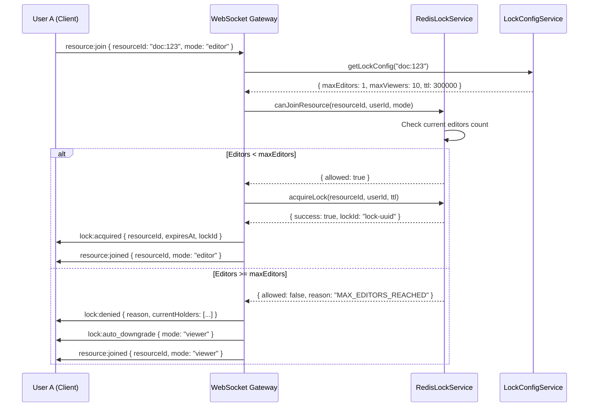
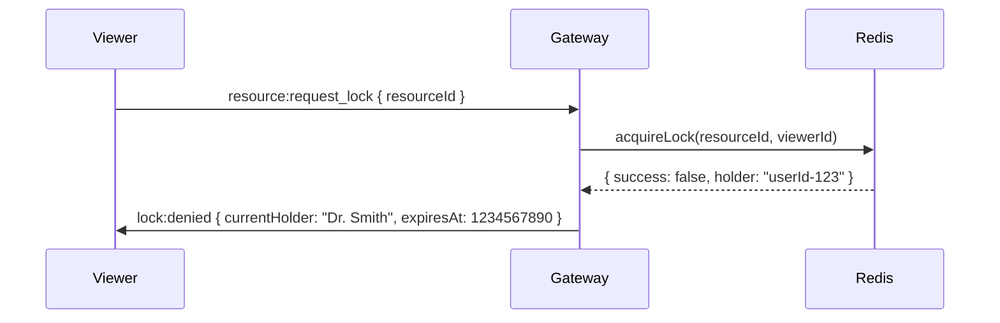
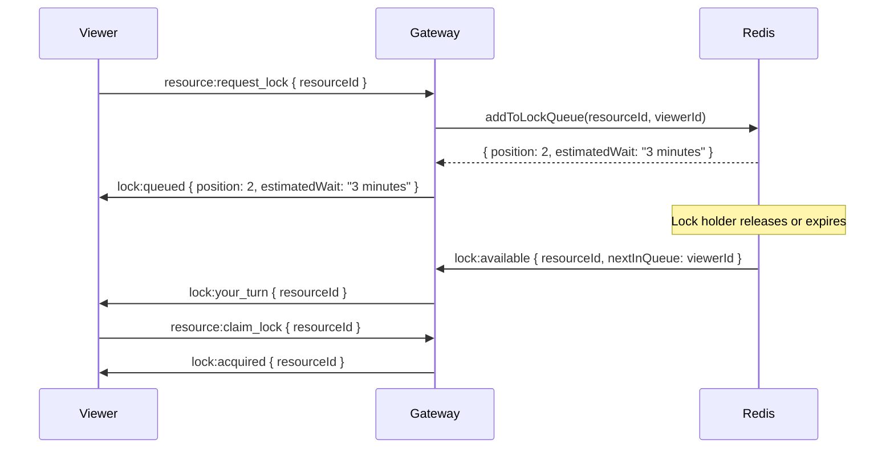
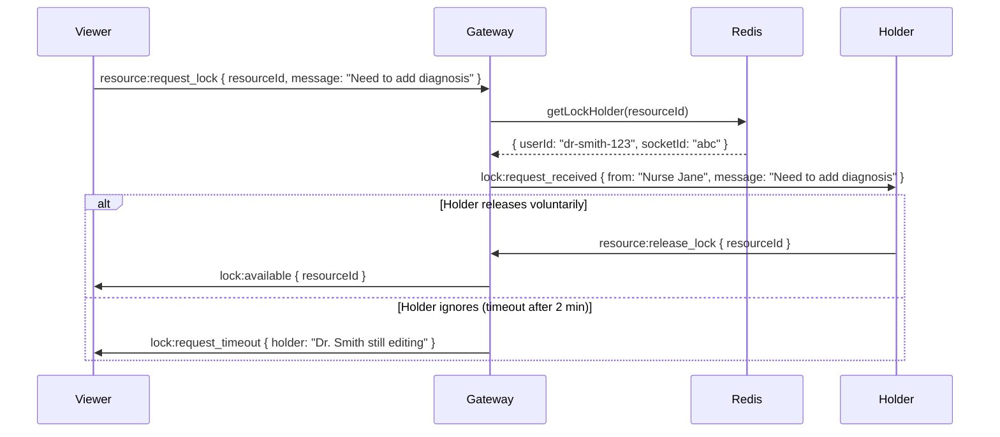
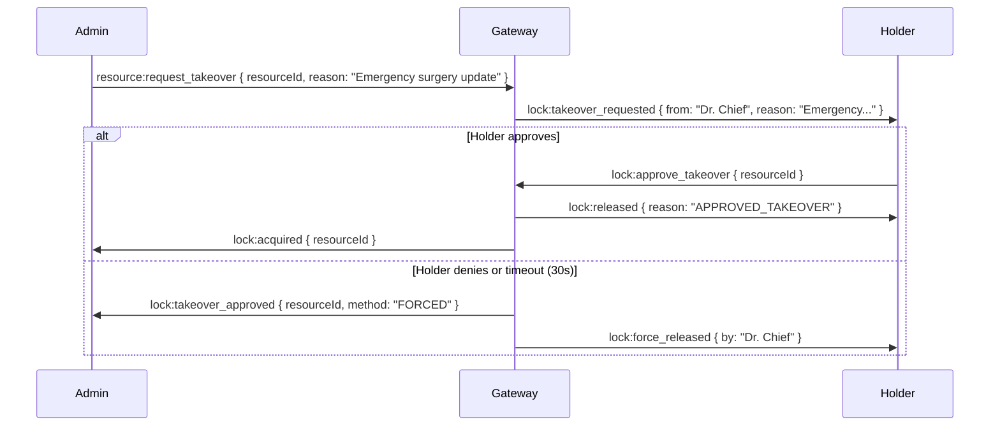

# BE-001.3: Distributed Locks - Technical Specification

> **Status**: 📋 Draft (Awaiting UI Team Review)  
> **Version**: 1.0.0-draft  
> **Date**: November 16, 2025  
> **Author**: Backend Team (Antonio Cittadino)  
> **Reviewers**: UI Team (Pending)

---

## 🎯 Executive Summary

Implement exclusive editor locking to prevent data loss when multiple users edit the same healthcare resource. Lock mechanism must support:

1. **Single-editor enforcement** (ALWAYS 1 editor per child resource)
2. **Unlimited viewers** (all users can view if editor permits, no hard limit)
3. **Canonical hierarchical pattern** (`resource:uuid:child`, default child is `main`)
4. **TTL with heartbeat** (5 min default, auto-renewal)
5. **Admin takeover** (forceful lock claim with audit trail)

**Critical**: Production blocker for healthcare compliance (HIPAA audit trail, data integrity).

### Core Rules (Immutable)

- **Pattern**: All resources MUST follow `type:uuid:child` format (auto-append `:main` if missing)
- **Editors**: ALWAYS max 1 editor per child resource (non-configurable)
- **Viewers**: Unlimited viewers per child resource (configurable per resource type if needed)
- **Locks**: Independent per child (e.g., `doc:123:patient` and `doc:123:diagnosis` are separate)

---

## 🚨 CRITICAL CLARIFICATION NEEDED: Viewer Permission Model

**Your Requirement**: "Tutti gli utenti possono essere in modalità viewer **se concesso dall'editor**"

**Question**: What does "se concesso dall'editor" mean exactly?

### **Option A: No Permission Check (Open Viewing)**

```typescript
// All users can view immediately, no editor permission needed
// "Se concesso" = handled by upstream auth (not WebSocket Gateway)

User A (Editor): Joins "doc:123:main" as editor → Gets lock
User B, C, D: Join "doc:123:main" as viewer → Immediately allowed
// Editor has no control over who views
```

**Assumption**: "Se concesso dall'editor" refers to **application-level permissions** (e.g., resource ACLs in database), NOT real-time permission from WebSocket editor.

---

### **Option B: Editor Whitelist (Explicit Approval Required)**

```typescript
// Editor must explicitly approve each viewer before they can join

User B: Joins "doc:123:main" as viewer
Server → Editor (User A): viewer:join_request { userId: "user-b", username: "Dr. Smith" }
Editor (User A): Approves → emit viewer:approve { userId: "user-b" }
Server → User B: resource:joined { mode: "viewer" }

// OR Editor denies
Editor (User A): Denies → emit viewer:deny { userId: "user-b", reason: "Sensitive data" }
Server → User B: resource:join_denied { reason: "EDITOR_DENIED" }
```

**Complexity**: High - requires real-time approval flow, queueing, timeout logic

---

### **Option C: Editor Blacklist (Kick Viewers)**

```typescript
// All users can join as viewer, editor can kick them out

User B, C, D: Join "doc:123:main" as viewer → Immediately allowed
Editor (User A): Kicks User C → emit viewer:kick { userId: "user-c", reason: "Private section" }
Server → User C: resource:kicked { reason: "EDITOR_KICKED", by: "user-a" }
User C: Disconnected from resource
```

**Complexity**: Medium - simpler than whitelist, gives editor control

---

### **🤔 CRITICAL QUESTION (BLOCKS IMPLEMENTATION)**

**Which viewer permission model do you need?**

- [ ] **Option A**: No permission check (open viewing, simplest) → Ships Week 3
- [ ] **Option B**: Editor whitelist (approval required) → Ships Week 4-5
- [ ] **Option C**: Editor blacklist (kick viewers) → Ships Week 4

**My Strong Recommendation**: **Option A** (no permission check at WebSocket level).

**Rationale**:

1. **WebSocket Gateway** should handle real-time locking, NOT authorization
2. **Authorization** should be handled upstream (JWT claims, database ACLs)
3. **Simpler = Less bugs** = Faster to production
4. **Separation of concerns**: Gateway = sync, Auth service = permissions

**If you need editor control**, Option C (blacklist/kick) is better UX than Option B (whitelist).

---

**⚠️ PLEASE CONFIRM BEFORE I PROCEED** ⚠️

---

## 📊 Lock Acquisition Flow



---

## 🔢 Lock Limits Configuration (Clarified Rules)

### **Immutable Rules** (Non-Negotiable)

```typescript
// ALWAYS enforced, no configuration needed
const LOCK_RULES = {
  maxEditorsPerChild: 1, // ALWAYS 1 (cannot be changed)
  maxViewersPerChild: Infinity, // No hard limit (configurable below if needed)
};
```

### **Canonical Resource ID Pattern**

```typescript
// Client can send 2-part or 3-part resource IDs
// Server ALWAYS normalizes to 3-part format

// Examples:
"document:123"           → normalized to → "document:123:main"
"document:123:patient"   → already valid  → "document:123:patient"
"operation:456"          → normalized to → "operation:456:main"
"operation:456:procedure" → already valid → "operation:456:procedure"
```

**Implementation**:

```typescript
class LockService {
  private normalizeResourceId(resourceId: string): string {
    const parts = resourceId.split(':');

    if (parts.length === 2) {
      // Auto-append default child "main"
      return `${resourceId}:main`;
    }

    if (parts.length < 2) {
      throw new InvalidResourceIdError(
        'Resource ID must have at least type:uuid',
      );
    }

    return resourceId; // Already 3+ parts (hierarchical)
  }
}
```

---

### **Optional Viewer Limits** (Per Resource Type)

```yaml
# config/lock-limits.yml
default:
  maxEditorsPerChild: 1 # IMMUTABLE (always 1)
  maxViewersPerChild: null # null = unlimited
  ttl: 300000 # 5 minutes
  heartbeatInterval: 60000
  gracePeriod: 30000

resourceTypes:
  operation-report:
    maxViewersPerChild: 10 # Limit for sensitive data

  patient-chart:
    maxViewersPerChild: null # Unlimited (collaborative)

  document:
    maxViewersPerChild: 50 # Reasonable limit to prevent abuse
```

**Rationale**: Viewer limits optional (default unlimited), but can be configured per resource type for security/performance.

---

### **🤔 QUESTION 1 FOR UI TEAM (UPDATED)**

**Should we enforce viewer limits per resource type?**

- [ ] **Option A**: No limits (unlimited viewers everywhere, simplest)
- [ ] **Option B**: Configurable per resource type (security for sensitive docs)
- [ ] **Option C**: Global limit (e.g., max 100 viewers per child)

**My Recommendation**: **Option B** (configurable per type) - allows flexibility for sensitive operation reports while keeping patient charts open.

---

## 🔄 Lock Upgrade Flow (Viewer → Editor)

**Scenario**: Viewer wants to become editor, but lock already held.

### **Option A: Immediate Deny + Notification**



**Pros**: Simple, instant feedback  
**Cons**: Poor UX (user blocked, no recourse)

---

### **Option B: Queue + Notify When Available**



**Pros**: Fair, better UX  
**Cons**: Complex (queue management, Redis LIST structure, notify logic)

---

### **Option C: "Request Lock" Button (Push Notification to Holder)**



**Pros**: Human collaboration, polite  
**Cons**: Relies on holder responding (not guaranteed)

---

### **🤔 QUESTION 2 FOR UI TEAM**:

**Which lock upgrade flow do you prefer?**

- [ ] **Option A**: Immediate deny + notification (simple, ships Week 3)
- [ ] **Option B**: Queue + notify (fair, ships Week 4)
- [ ] **Option C**: "Request Lock" button (collaborative, ships Week 4)

**My Recommendation**: **Option C** for healthcare (encourages communication), fallback to **Option A** if no response after 2 minutes.

---

## 🔌 Lock Holder Disconnect Handling

**Scenario**: Lock holder loses connection unexpectedly (network issue, browser crash).

### **Option A: Immediate Release**

```typescript
async handleDisconnect(client: Socket) {
  const userId = client.data.userId;
  const lockedResources = await this.redis.getUserLocks(userId);

  for (const resourceId of lockedResources) {
    await this.redis.releaseLock(resourceId, userId);
    this.server.to(resourceId).emit('lock:released', {
      resourceId,
      releasedBy: userId,
      reason: 'DISCONNECT',
    });
  }
}
```

**Pros**: Immediate availability for others  
**Cons**: False positives (temporary network glitch = lose lock)

---

### **Option B: Grace Period (30s) for Reconnection**

```typescript
async handleDisconnect(client: Socket) {
  const userId = client.data.userId;
  const lockedResources = await this.redis.getUserLocks(userId);

  // Set grace period flag
  await this.redis.setGracePeriod(userId, lockedResources, 30000);

  setTimeout(async () => {
    const stillDisconnected = !(await this.isUserConnected(userId));
    if (stillDisconnected) {
      // Release after grace period
      for (const resourceId of lockedResources) {
        await this.redis.releaseLock(resourceId, userId);
        this.server.to(resourceId).emit('lock:released', {
          resourceId,
          releasedBy: userId,
          reason: 'GRACE_PERIOD_EXPIRED',
        });
      }
    }
  }, 30000);
}
```

**Pros**: Survives temporary network issues  
**Cons**: Others wait 30s unnecessarily if true disconnect

---

### **Option C: Prompt Other Users (Democratic)**

```typescript
async handleDisconnect(client: Socket) {
  const userId = client.data.userId;
  const lockedResources = await this.redis.getUserLocks(userId);

  for (const resourceId of lockedResources) {
    this.server.to(resourceId).emit('lock:holder_disconnected', {
      resourceId,
      holder: userId,
      actions: ['WAIT_30S', 'CLAIM_NOW'],
    });
  }

  // First to claim gets lock
  // OR automatic release after 30s if no claim
}
```

**Pros**: User decides (UX flexibility)  
**Cons**: Race condition if multiple claim simultaneously

---

### **🤔 QUESTION 3 FOR UI TEAM**:

**How should we handle lock holder disconnect?**

- [ ] **Option A**: Immediate release (fast, ships Week 3)
- [ ] **Option B**: 30s grace period (forgiving, ships Week 3)
- [ ] **Option C**: Prompt other users (democratic, ships Week 4)

**My Recommendation**: **Option B** (30s grace period) - balances availability and forgiveness.

---

## 📊 Tab Lock Limits (Hierarchical Resources)

**Scenario**: User editing multiple tabs in same document.

### **Option A: No Limit (Unlimited Tabs)**

```typescript
// User can lock unlimited child tabs
document:123/tab:patient-info      ✅ Locked by User A
document:123/tab:diagnosis          ✅ Locked by User A
document:123/tab:procedure-notes    ✅ Locked by User A
document:123/tab:medications        ✅ Locked by User A
// ... (no limit)
```

**Pros**: Maximum flexibility  
**Cons**: Memory leak risk (user forgets to release), unfair hoarding

---

### **Option B: Fixed Limit (e.g., 5 Tabs Per User)**

```typescript
// Config
MAX_CONCURRENT_TAB_LOCKS_PER_USER = 5;

// Enforcement
async acquireLock(resourceId: string, userId: string) {
  const userLocks = await this.redis.getUserLocks(userId);
  const tabLocks = userLocks.filter(r => r.includes('/tab:'));

  if (tabLocks.length >= MAX_CONCURRENT_TAB_LOCKS_PER_USER) {
    throw new MaxTabLocksExceededError({
      current: tabLocks.length,
      max: MAX_CONCURRENT_TAB_LOCKS_PER_USER,
      message: 'Release a tab before locking another',
    });
  }

  // Proceed with lock acquisition
}
```

**Pros**: Prevents hoarding, fair  
**Cons**: Arbitrary limit (why 5? why not 10?)

---

### **Option C: Configurable Per Resource Type**

```yaml
# config/lock-limits.yml
resourceTypes:
  document:
    maxConcurrentTabLocksPerUser: 3

  operation-report:
    maxConcurrentTabLocksPerUser: 5

  patient-chart:
    maxConcurrentTabLocksPerUser: 10
```

**Pros**: Flexible, domain-specific  
**Cons**: More configuration complexity

---

### **🤔 QUESTION 4 FOR UI TEAM**:

**Should we limit concurrent tab locks per user?**

- [ ] **Option A**: No limit (simplest, ships Week 3)
- [ ] **Option B**: Fixed limit (5 tabs) (fair, ships Week 3)
- [ ] **Option C**: Configurable per resource type (flexible, ships Week 4)

**My Recommendation**: **Option B** (5 tabs) as sensible default, make configurable later if needed.

---

## 🚨 Admin Force Takeover (Lock Hijack)

**Scenario**: Surgeon needs to edit urgently, but nurse holds lock.

### **Option A: Immediate Takeover (No Confirmation)**

```typescript
async adminTakeover(resourceId: string, adminUserId: string, reason: string) {
  // Get current holder
  const currentHolder = await this.redis.getLockHolder(resourceId);

  // Force release
  await this.redis.releaseLock(resourceId, currentHolder.userId);

  // Admin acquires
  await this.redis.acquireLock(resourceId, adminUserId, TTL);

  // Audit log
  await this.auditLog.log({
    action: 'LOCK_TAKEOVER',
    resourceId,
    adminUserId,
    previousHolder: currentHolder.userId,
    reason,
    timestamp: Date.now(),
  });

  // Notify previous holder
  this.server.to(currentHolder.socketId).emit('lock:taken_by_admin', {
    resourceId,
    admin: adminUserId,
    reason,
  });
}
```

**Pros**: Fast, surgical emergencies supported  
**Cons**: Disruptive to previous holder (could lose unsaved work)

---

### **Option B: Request Approval (Soft Takeover)**



**Pros**: Polite, gives holder chance to save work  
**Cons**: Delays admin (30s timeout)

---

### **🤔 QUESTION 5 FOR UI TEAM**:

**How should admin force takeover work?**

- [ ] **Option A**: Immediate takeover (fast, ships Week 3)
- [ ] **Option B**: Request approval with 30s timeout (polite, ships Week 4)
- [ ] **Option C**: No force takeover (rely on lock TTL expiry)

**My Recommendation**: **Option B** (request approval with timeout) - balances urgency and courtesy.

---

## 🔐 Proposed Lock Config Schema (UPDATED)

Based on clarified requirements (1 editor per child, unlimited viewers):

```yaml
# config/lock-limits.yml
default:
  maxEditorsPerChild: 1 # IMMUTABLE (always enforced)
  maxViewersPerChild: null # null = unlimited
  ttl: 300000 # 5 minutes
  heartbeatInterval: 60000 # 1 minute
  gracePeriod: 30000 # 30 seconds on disconnect
  maxChildLocksPerUser: 5 # Max concurrent child locks per user
  defaultChild: 'main' # Auto-appended if missing

resourceTypes:
  document:
    maxViewersPerChild: null # Unlimited viewers
    ttl: 300000
    maxChildLocksPerUser: 3

  operation-report:
    maxViewersPerChild: 10 # Limit for sensitive data
    ttl: 600000 # 10 minutes (complex edits)
    maxChildLocksPerUser: 5

  patient-chart:
    maxViewersPerChild: null # Unlimited (collaborative)
    ttl: 300000
    maxChildLocksPerUser: 10

adminTakeover:
  enabled: true
  requestTimeout: 30000 # 30s approval window
  auditRequired: true
```

### TypeScript Interface

```typescript
export interface LockConfig {
  maxEditorsPerChild: 1; // Literal type: always 1 (immutable)
  maxViewersPerChild: number | null; // null = unlimited
  ttl: number;
  heartbeatInterval: number;
  gracePeriod: number;
  maxChildLocksPerUser: number; // Max concurrent child locks per user
  defaultChild: string; // Default child name (e.g., "main")
}

export interface AdminTakeoverConfig {
  enabled: boolean;
  requestTimeout: number;
  auditRequired: boolean;
}

export interface LockConfigSchema {
  default: LockConfig;
  resourceTypes: Record<string, Partial<LockConfig>>;
  adminTakeover: AdminTakeoverConfig;
}

// Resource ID normalization
export type ResourceId = `${string}:${string}:${string}`; // Always 3 parts

export interface NormalizedResourceId {
  type: string; // e.g., "document"
  uuid: string; // e.g., "123"
  child: string; // e.g., "main", "patient", "diagnosis"
  canonical: ResourceId; // Full normalized ID
}
```

---

## 🧪 Edge Cases Matrix

| #   | Scenario                                                                 | Expected Behavior                                         | Priority |
| --- | ------------------------------------------------------------------------ | --------------------------------------------------------- | -------- |
| 1   | User A holds lock, User B joins as viewer                                | ✅ User B allowed as viewer (no limit)                    | High     |
| 2   | User A holds lock, User A reconnects (same userId, new socket)           | ✅ Lock persists (keyed by userId, not socketId)          | High     |
| 3   | User A holds lock on `doc:123:patient`, User B locks `doc:123:diagnosis` | ✅ Both locks coexist (independent children)              | High     |
| 4   | User A holds 5 tab locks, tries to lock 6th tab                          | ❌ Deny with `MAX_TAB_LOCKS_EXCEEDED`                     | Medium   |
| 5   | Lock TTL expires, User A still connected but no heartbeat                | ✅ Lock auto-released, broadcast `lock:expired`           | High     |
| 6   | User A disconnects, grace period 30s, reconnects at 20s                  | ✅ Lock preserved, grace period cancelled                 | Medium   |
| 7   | Admin forces takeover, previous holder has unsaved changes               | ⚠️ Previous holder receives warning, loses lock           | High     |
| 8   | Redis connection lost during lock acquisition                            | ❌ Fail gracefully, return error to client                | Critical |
| 9   | Two users request lock simultaneously (race condition)                   | ✅ Redis SETNX ensures only one succeeds                  | Critical |
| 10  | User A holds lock, sends heartbeat at 59s intervals (within TTL)         | ✅ Lock renewed every heartbeat                           | High     |
| 11  | Client sends `doc:123` (2 parts)                                         | ✅ Server normalizes to `doc:123:main`                    | High     |
| 16  | User joins `doc:123:main` as viewer, no editor present                   | ✅ User allowed as viewer (no editor permission needed)   | Medium   |
| 17  | Editor permits/denies viewers                                            | ⚠️ **CLARIFICATION NEEDED**: Is this feature required?    | Critical |
| 12  | User A requests lock upgrade (viewer → editor) while in queue            | ⚠️ Queue position preserved, notified when available      | Low      |
| 13  | Lock holder crashes without disconnect event                             | ✅ TTL expiry (5 min) releases lock automatically         | High     |
| 14  | User A locks resource, User B requests takeover, User A approves         | ✅ Graceful handoff, User A saves before releasing        | Medium   |
| 15  | Hierarchical resource: User locks `doc:123/tab:A/section:1`              | ✅ Deepest level locked, parent/sibling locks independent | Low      |

---

## 📋 Implementation Checklist (Phase 1 - Week 3)

### RedisLockService

- [ ] `acquireLock(resourceId, userId, ttl)` → `Promise<LockResult>`
- [ ] `releaseLock(resourceId, userId)` → `Promise<boolean>`
- [ ] `renewLock(resourceId, userId)` → `Promise<boolean>`
- [ ] `getLockHolder(resourceId)` → `Promise<LockInfo | null>`
- [ ] `getUserLocks(userId)` → `Promise<string[]>`
- [ ] `canJoinResource(resourceId, userId, mode)` → `Promise<JoinResult>`
- [ ] Grace period handling (30s on disconnect)
- [ ] Redis connection health check + Circuit Breaker

### WebSocket Events (Gateway)

- [ ] `lock:acquired` event (server → client)
- [ ] `lock:denied` event (server → client)
- [ ] `lock:released` event (server → all in resource)
- [ ] `lock:expired` event (server → all in resource)
- [ ] `lock:auto_downgrade` event (server → client)
- [ ] `resource:request_lock` handler (client → server)
- [ ] `resource:release_lock` handler (client → server)
- [ ] Heartbeat renewal (`user:heartbeat` → renew all user locks)

### LockConfigService

- [ ] Load config from `config/lock-limits.yml`
- [ ] `getLockConfig(resourceId)` → resolve type-specific or default
- [ ] Environment variable overrides (e.g., `LOCK_DEFAULT_TTL`)

### BDD Tests (Phase 1)

- [ ] Scenario 1: First editor acquires lock
- [ ] Scenario 2: Second editor auto-downgraded to viewer
- [ ] Scenario 3: Lock released when holder leaves
- [ ] Scenario 4: Lock expires after TTL without heartbeat
- [ ] Scenario 5: Lock renewed with heartbeat
- [ ] Scenario 6: Viewer upgrade denied (lock held)

---

## 📋 Implementation Checklist (Phase 2 - Week 4)

### Hierarchical Locking

- [ ] Parse hierarchical resource IDs (`doc:123/tab:patient`)
- [ ] Independent lock tracking per child resource
- [ ] Tab lock limit enforcement (max 5 per user)
- [ ] Parent presence independent of child locks

### Lock Upgrade Queue (if Option B chosen)

- [ ] `addToLockQueue(resourceId, userId)` → Redis LIST
- [ ] `notifyNextInQueue(resourceId)` → emit `lock:your_turn`
- [ ] `removeFromQueue(resourceId, userId)` → cleanup

### Admin Takeover (if Option B chosen)

- [ ] `resource:request_takeover` handler (admin → holder)
- [ ] `lock:takeover_requested` event (server → holder)
- [ ] `lock:approve_takeover` handler (holder → admin)
- [ ] Force takeover after 30s timeout
- [ ] Audit log entry for all takeovers

### BDD Tests (Phase 2)

- [ ] Scenario 7: Multiple tabs locked by different users
- [ ] Scenario 8: Same tab lock conflict
- [ ] Scenario 9: User holds multiple tab locks (within limit)
- [ ] Scenario 10: Parent presence does not block child locks

---

## 🚦 Open Questions Summary (Requires UI Team Answers)

| #   | Question            | Recommended Option          | Complexity | ETA    |
| --- | ------------------- | --------------------------- | ---------- | ------ |
| 1   | Carnot table config | Option B (resource-type)    | Medium     | Week 3 |
| 2   | Lock upgrade flow   | Option C (request button)   | High       | Week 4 |
| 3   | Disconnect handling | Option B (30s grace period) | Low        | Week 3 |
| 4   | Tab lock limit      | Option B (5 tabs fixed)     | Low        | Week 3 |
| 5   | Admin takeover      | Option B (request approval) | Medium     | Week 4 |

**UI Team: Please review and select options by Monday, November 18, 2025 @ 9:00 AM**

---

## 📞 Next Steps

### Backend Team (Post-Approval)

1. **Monday 09:00-10:00**: Review UI Team answers
2. **Monday 10:00-12:00**: Setup Redis Docker Compose, ioredis integration
3. **Monday 14:00-18:00**: Implement RedisLockService core (acquire/release/renew)
4. **Tuesday-Wednesday**: WebSocket events + LockConfigService
5. **Thursday-Friday**: BDD tests Phase 1 (6 scenarios)

### UI Team (Action Required)

1. **Review this spec document** (estimated 30 minutes)
2. **Answer 5 questions** (select options A/B/C for each)
3. **Provide feedback** on edge cases matrix (any missing scenarios?)
4. **Sync meeting**: Monday, November 18, 2025 @ 10:00 AM

---

**Document Version**: 1.0.0-draft  
**Last Updated**: November 16, 2025  
**Status**: ⏳ Awaiting UI Team Review  
**Target Approval**: November 18, 2025 @ 09:00 AM
