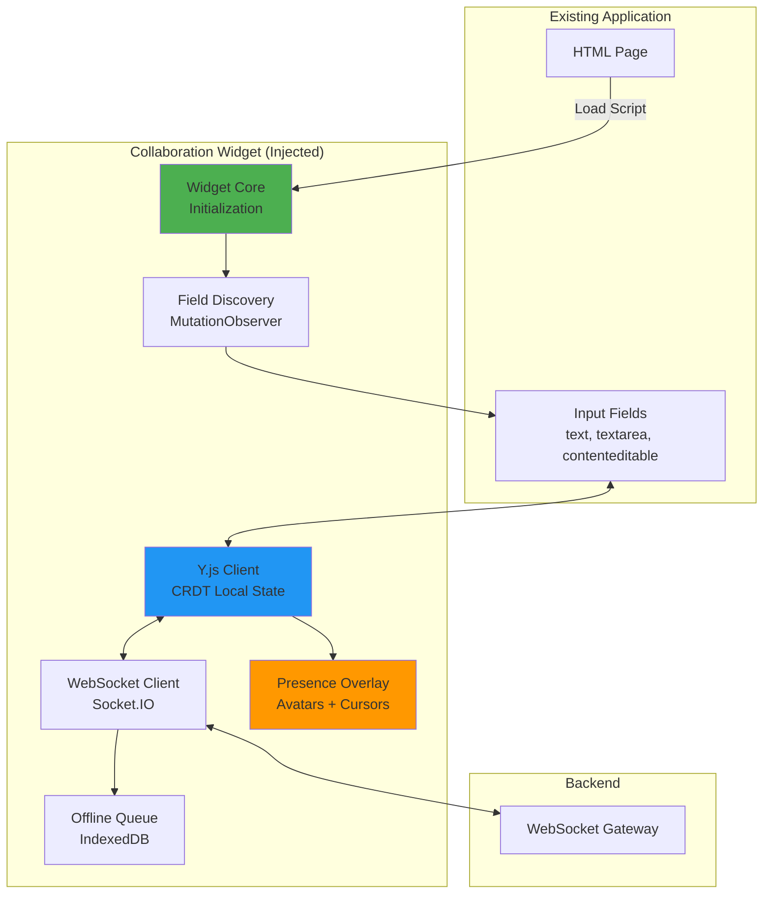

# EPIC-002: Collaboration Widget SDK

> **Epic ID**: FE-001
> **Priority**: High
> **Difficulty**: High
> **Timeline**: Weeks 9-13 (5 settimane)
> **Team**: 1 frontend developer
> **Status**: 📋 Planned
> **Start Date**: January 11, 2026 (estimated)

---

## 📋 Overview

**Obiettivo**: Creare JavaScript widget per integrazione zero-code con applicazioni healthcare esistenti, permettendo collaboration real-time senza modificare il codice sorgente dell'app.

**Caratteristiche chiave**:

- Auto-discovery di input fields (text, textarea, contenteditable)
- Integrazione con < 2 righe di codice HTML
- Real-time presence UI (avatars, cursors, typing indicators)
- Offline-first con queue management
- Bundle size < 150KB gzipped
- CDN distribution con semver
- Esempi per React, Vue, Angular, Vanilla JS

**Riferimenti tecnici**: Vedere `/docs/PROJECT.md` Sezione 4 per architettura completa e diagrammi.

---

## 🏗️ Architettura Frontend



---

## 📖 User Stories

### Story FE-001.1: Widget Auto-Discovery & Initialization

**Timeline**: Week 9-10
**Assignee**: TBD
**Status**: 📋 Planned

#### Feature: Automatic Input Field Detection and Binding

```gherkin
Feature: Automatic Input Field Detection and Binding
  As a developer integrating the widget
  I want the widget to automatically detect input fields
  So that I don't need to manually configure each field

  Scenario: Widget initialization with minimal code
    Given I have an HTML page with form inputs:
      """
      <input type="text" id="patient-name" />
      <textarea id="diagnosis"></textarea>
      <div contenteditable="true" id="notes"></div>
      """
    When I add the widget script to the page:
      """
      <script src="https://cdn.collabornest.io/widget/v1.0.0/collab.min.js"></script>
      <script>
        CollaborNest.init({ apiKey: 'YOUR_API_KEY' });
      </script>
      """
    Then the widget should automatically discover all 3 fields
    And each field should be wrapped with a collaboration handler
    And I should see presence indicators for each field

  Scenario: Detect dynamically added fields (SPA support)
    Given the widget is initialized
    And I have a React/Vue/Angular app
    When a new input field is added to the DOM:
      """
      <input type="text" id="new-field" />
      """
    Then the MutationObserver should detect it within 100ms
    And the field should be automatically bound
    And collaboration should work on the new field

  Scenario: Exclude fields from collaboration
    Given I have sensitive fields that should not be collaborative
    When I add data attributes:
      """
      <input type="password" data-collab-ignore="true" />
      """
    Then the widget should skip that field
    And no collaboration handlers should be attached

  Acceptance Criteria:
    - [ ] Auto-detect input, textarea, contenteditable
    - [ ] MutationObserver for dynamic content
    - [ ] Support for data-collab-ignore attribute
    - [ ] Initialization with API key only (< 2 lines of code)
    - [ ] Works with React, Vue, Angular, Vanilla JS
    - [ ] Field detection < 100ms after DOM change
```

---

### Story FE-001.2: Real-time Collaboration UI

**Timeline**: Week 10-11
**Assignee**: TBD
**Status**: 📋 Planned

#### Feature: Visual Feedback for Collaboration

```gherkin
Feature: Visual Feedback for Collaboration
  As a user collaborating on a form
  I want to see visual indicators of other users' activity
  So that I can coordinate edits and avoid conflicts

  Scenario: Display presence avatars
    Given I am editing a field "patient-name"
    And 2 other users are also editing the same resource
    When the widget receives "USER_JOINED" events
    Then I should see 3 avatar circles next to the field
    And each avatar should show the user's initials or photo
    And hovering should show the full name and role

  Scenario: Show remote cursors (contenteditable only)
    Given I am editing a contenteditable field
    And another user is typing in the same field
    When they move their cursor to position 42
    Then I should see their cursor at that exact position
    And the cursor should have their name label
    And the cursor color should be unique per user

  Scenario: Typing indicators
    Given I am viewing a field
    And another user starts typing
    When their keystrokes are detected
    Then I should see "John is typing..." indicator
    And the indicator should disappear after 2 seconds of inactivity

  Scenario: Lock visual feedback
    Given another user has locked a field
    When I try to click on it
    Then the field should have a yellow border
    And a tooltip should say "Locked by John Doe (expires in 25s)"
    And I should not be able to edit

  Acceptance Criteria:
    - [ ] Presence avatars (max 5 visible, +N indicator)
    - [ ] Remote cursors for contenteditable
    - [ ] Typing indicators
    - [ ] Lock visual feedback (border + tooltip)
    - [ ] Color coding per user (consistent across sessions)
    - [ ] Smooth animations (CSS transitions)
    - [ ] Mobile-responsive UI
```

---

### Story FE-001.3: Offline Support & Queue Management

**Timeline**: Week 11-12
**Assignee**: TBD
**Status**: 📋 Planned

#### Feature: Offline Editing and Synchronization

```gherkin
Feature: Offline Editing and Synchronization
  As a user in an area with poor connectivity
  I want to continue editing even when offline
  So that my work is not lost

  Scenario: Edit while offline
    Given I am connected to the gateway
    And I am editing a field
    When my internet connection drops
    Then the widget should detect the disconnect within 5 seconds
    And a yellow banner should appear: "Offline - changes will sync when reconnected"
    And I should still be able to type
    And my changes should be queued in IndexedDB

  Scenario: Automatic reconnection and sync
    Given I have 10 pending changes in the offline queue
    When my internet connection is restored
    Then the widget should reconnect to the gateway
    And all queued changes should be sent in order
    And I should receive "SYNC_COMPLETE" confirmation
    And the offline banner should disappear

  Scenario: Conflict resolution on reconnect
    Given I edited field A while offline
    And another user edited the same field while I was offline
    When I reconnect
    Then Y.js should automatically merge both changes
    And I should see the merged result
    And no data should be lost (CRDT guarantee)

  Acceptance Criteria:
    - [ ] Detect disconnect within 5 seconds
    - [ ] Queue changes in IndexedDB
    - [ ] Automatic reconnection with exponential backoff
    - [ ] Sync queued changes on reconnect
    - [ ] Conflict-free merge via Y.js
    - [ ] Visual feedback (offline banner)
    - [ ] Maximum queue size: 1000 operations
```

---

### Story FE-001.4: CDN Distribution & Versioning

**Timeline**: Week 12-13
**Assignee**: TBD
**Status**: 📋 Planned

#### Feature: CDN Deployment with Semantic Versioning

**Acceptance Criteria**:

- [ ] Webpack bundle with tree-shaking
- [ ] Minified + gzipped bundle < 150KB
- [ ] Source maps for debugging
- [ ] CDN deployment (Cloudflare or Fastly)
- [ ] Semver URLs: `https://cdn.collabornest.io/widget/v1.0.0/collab.min.js`
- [ ] Latest version alias: `https://cdn.collabornest.io/widget/latest/collab.min.js`
- [ ] Versioned API with backward compatibility
- [ ] Cache-Control headers (1 year for versioned, 5 min for latest)

---

### Story FE-001.5: Integration Testing & Documentation

**Timeline**: Week 13
**Assignee**: TBD
**Status**: 📋 Planned

#### Feature: Example Apps and Documentation

**Acceptance Criteria**:

- [ ] Example app: Vanilla JS (index.html)
- [ ] Example app: React
- [ ] Example app: Vue
- [ ] Example app: Angular
- [ ] API documentation (JSDoc + markdown)
- [ ] Integration guide (step-by-step)
- [ ] Troubleshooting section
- [ ] Video demo (5 minutes)
- [ ] All examples deployable to CodeSandbox or StackBlitz

---

## 🎯 Success Criteria (Epic Level)

Epic considered complete when ALL criteria met:

- [ ] < 2 lines of code integration
- [ ] Auto-detect input fields (text, textarea, contenteditable)
- [ ] Real-time presence UI (avatars, cursors)
- [ ] Offline editing with sync queue
- [ ] Widget bundle < 150KB gzipped
- [ ] CDN deployment with semver
- [ ] Example apps (React, Vue, Angular, Vanilla JS)
- [ ] All 5 user stories completed and tested
- [ ] E2E tests passing (browser automation with Playwright)
- [ ] Documentation complete (API docs + integration guide)
- [ ] Security audit passed (no XSS vulnerabilities)

---

## 🔗 References

- **Architecture**: `/docs/PROJECT.md` Section 4
- **BDD Scenarios**: `/docs/PROJECT.md` Section 4.3
- **ROADMAP**: `/docs/project/ROADMAP.md`
- **Backend Epic**: `/docs/project/EPIC-001-websocket-gateway.md`

---

**Last Updated**: November 16, 2025
**Next Review**: January 1, 2026
