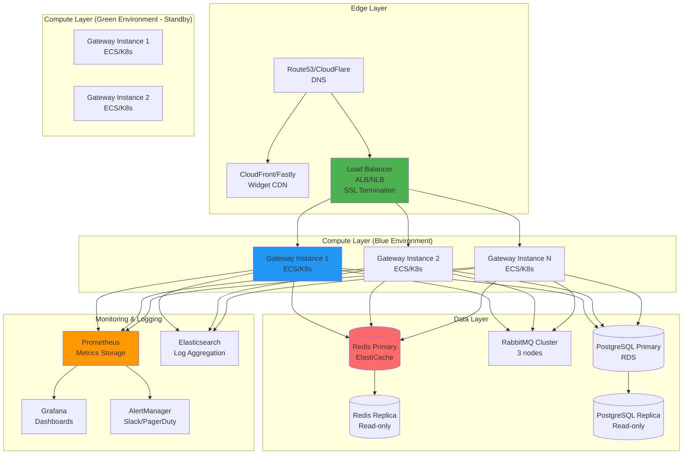

# EPIC-003: Production Infrastructure

> **Epic ID**: DEVOPS-001
> **Priority**: High
> **Difficulty**: Medium
> **Timeline**: Weeks 14-16 (3 settimane)
> **Team**: 1 DevOps engineer + 1 backend developer
> **Status**: 📋 Planned
> **Start Date**: February 15, 2026 (estimated)

---

## 📋 Overview

**Obiettivo**: Implementare infrastruttura production-ready con monitoring, CI/CD, disaster recovery, e security hardening per deployment in ambiente healthcare HIPAA-compliant.

**Componenti chiave**:

- Infrastructure as Code (Terraform)
- Blue-Green deployment con zero downtime
- Prometheus + Grafana monitoring
- Load testing con Artillery (1000+ concurrent users)
- Disaster recovery plan con backup automatici
- Security hardening (SSL/TLS, firewall, audit)

**Riferimenti tecnici**: Vedere `/docs/PROJECT.md` Sezione 5 per architettura completa e diagrammi.

---

## 🏗️ Infrastructure Architecture



---

## 📖 Tasks

### Task DEVOPS-001.1: Terraform Infrastructure as Code

**Timeline**: Week 14
**Assignee**: TBD
**Status**: 📋 Planned

#### Feature: Infrastructure as Code

```gherkin
Feature: Terraform-managed Infrastructure
  As a DevOps engineer
  I want to provision infrastructure using Terraform
  So that deployments are reproducible and versioned

  Scenario: Provision VPC and networking
    Given I have Terraform 1.5+ installed
    When I run terraform apply on networking module
    Then a VPC should be created with:
      | resource         | value                      |
      | CIDR block       | 10.0.0.0/16               |
      | Public subnets   | 3 (across availability zones) |
      | Private subnets  | 3 (across availability zones) |
      | NAT gateways     | 3 (one per AZ)            |
      | Internet gateway | 1                         |
    And all resources should be tagged with Environment and Project

  Scenario: Provision ECS cluster for Gateway
    Given networking infrastructure exists
    When I run terraform apply on compute module
    Then an ECS cluster should be created
    And task definition should specify:
      | parameter       | value                    |
      | CPU             | 1 vCPU                   |
      | Memory          | 2048 MB                  |
      | Desired count   | 3                        |
      | Health check    | /health endpoint         |
    And autoscaling should be enabled (min 3, max 10 instances)

  Scenario: Provision RDS PostgreSQL
    Given VPC and subnets exist
    When I run terraform apply on database module
    Then RDS PostgreSQL should be created with:
      | parameter          | value                  |
      | Engine version     | 15.x                   |
      | Instance class     | db.t3.medium           |
      | Storage            | 100 GB (gp3)           |
      | Multi-AZ           | true                   |
      | Automated backups  | enabled (7 days)       |
      | Encryption         | enabled (KMS)          |

  Acceptance Criteria:
    - [ ] Terraform modules for VPC, compute, database, cache, messaging
    - [ ] Remote state in S3 with DynamoDB locking
    - [ ] Separate environments (dev, staging, prod)
    - [ ] All secrets managed via AWS Secrets Manager
    - [ ] Infrastructure code in /terraform directory
    - [ ] README with setup instructions
    - [ ] Cost estimation using terraform cost
```

---

### Task DEVOPS-001.2: Blue-Green Deployment Pipeline

**Timeline**: Week 14
**Assignee**: TBD
**Status**: 📋 Planned

#### Feature: Blue-Green Deployment with GitHub Actions

```gherkin
Feature: CI/CD Pipeline with Blue-Green Deployment
  As a developer
  I want automated deployments with zero downtime
  So that releases are safe and reversible

  Scenario: Build and test on every push
    Given I push code to main branch
    When GitHub Actions workflow starts
    Then it should:
      | step                | command                 |
      | Checkout code       | actions/checkout@v3     |
      | Install dependencies| npm ci                  |
      | Run linter          | npm run lint:check      |
      | Run unit tests      | npm test                |
      | Run integration tests| npm run test:integration:safe |
      | Build application   | npm run build           |
    And all steps must pass before proceeding

  Scenario: Deploy to Green environment
    Given build and tests passed
    When deployment step starts
    Then a new ECS task definition should be created
    And Green environment should deploy the new version
    And health checks should verify Green is healthy
    And traffic should remain on Blue (0% cutover)

  Scenario: Smoke test Green environment
    Given Green environment is running
    When smoke tests execute
    Then they should verify:
      | test                | endpoint               |
      | Health check        | GET /health            |
      | WebSocket connect   | WSS /ws with test JWT  |
      | Metrics endpoint    | GET /metrics           |
    And all tests must pass within 2 minutes

  Scenario: Cutover traffic to Green
    Given smoke tests passed
    When traffic switch is triggered
    Then load balancer should:
      | step          | traffic distribution  |
      | Initial       | Blue 100%, Green 0%   |
      | After 1 min   | Blue 50%, Green 50%   |
      | After 2 min   | Blue 0%, Green 100%   |
    And Blue environment should remain standby for 30 minutes

  Scenario: Rollback on failure
    Given Green environment deployment failed smoke tests
    When rollback is triggered
    Then traffic should remain on Blue 100%
    And Green environment should be terminated
    And rollback alert should be sent to Slack

  Acceptance Criteria:
    - [ ] GitHub Actions workflow: .github/workflows/deploy.yml
    - [ ] Blue-Green deployment strategy
    - [ ] Automated smoke tests
    - [ ] Traffic cutover with gradual shift
    - [ ] Automatic rollback on failure
    - [ ] Slack notifications for deployments
    - [ ] Deployment time < 10 minutes
```

---

### Task DEVOPS-001.3: Prometheus + Grafana Monitoring

**Timeline**: Week 15
**Assignee**: TBD
**Status**: 📋 Planned

#### Feature: System Health Monitoring and Alerting

```gherkin
Feature: Prometheus Metrics and Grafana Dashboards
  As a DevOps engineer
  I want real-time monitoring of system health
  So that I can detect and respond to issues quickly

  Scenario: Expose application metrics
    Given the Gateway application is running
    When I query GET /metrics endpoint
    Then Prometheus-formatted metrics should be returned:
      | metric name                          | type      |
      | websocket_connections_total          | gauge     |
      | websocket_messages_sent_total        | counter   |
      | websocket_messages_received_total    | counter   |
      | lock_acquisitions_total              | counter   |
      | lock_acquisition_duration_seconds    | histogram |
      | redis_operation_duration_seconds     | histogram |
      | rabbitmq_publish_total               | counter   |
      | audit_logs_written_total             | counter   |

  Scenario: Create Grafana dashboard for WebSocket metrics
    Given Prometheus is scraping metrics
    When I import the WebSocket dashboard
    Then I should see panels for:
      | panel                  | visualization  |
      | Active Connections     | Time series    |
      | Messages/sec           | Graph          |
      | P99 Latency            | Gauge          |
      | Error Rate             | Graph          |
      | Top Resources by Users | Bar chart      |
    And dashboard should auto-refresh every 10 seconds

  Scenario: Configure alerts for critical thresholds
    Given Prometheus AlertManager is configured
    When a metric exceeds threshold:
      | metric                    | threshold       | action        |
      | Error rate                | > 1%            | Slack alert   |
      | P99 latency               | > 500ms         | Slack alert   |
      | Active connections        | > 1000          | Info message  |
      | Redis connection failures | > 0             | PagerDuty     |
    Then appropriate alert should fire within 1 minute
    And alert should include runbook link

  Acceptance Criteria:
    - [ ] Prometheus server deployed (EC2 or managed service)
    - [ ] Grafana deployed with datasource configured
    - [ ] Application exposes /metrics endpoint
    - [ ] Custom dashboards for WebSocket, Redis, RabbitMQ, PostgreSQL
    - [ ] AlertManager configured with Slack integration
    - [ ] Alert rules for P99 latency, error rate, connection failures
    - [ ] Runbooks in /docs/runbooks/
```

---

### Task DEVOPS-001.4: Load Testing with Artillery

**Timeline**: Week 15
**Assignee**: TBD
**Status**: 📋 Planned

#### Feature: Performance and Load Testing

```gherkin
Feature: Load Testing with Artillery
  As a DevOps engineer
  I want to verify system performance under load
  So that I can validate scalability requirements

  Scenario: Baseline load test (100 users)
    Given the system is in steady state
    When I run artillery run tests/load/baseline.yml
    Then the test should simulate:
      | phase       | duration | users/sec |
      | Warm-up     | 60s      | 10        |
      | Ramp-up     | 120s     | 1-100     |
      | Sustained   | 300s     | 100       |
      | Ramp-down   | 60s      | 100-0     |
    And results should show:
      | metric           | target    | actual |
      | P99 latency      | < 200ms   | ?      |
      | Error rate       | < 0.1%    | ?      |
      | WebSocket uptime | > 99.9%   | ?      |

  Scenario: Stress test (1000+ concurrent users)
    Given the system is at baseline
    When I run artillery run tests/load/stress.yml
    Then 1000 concurrent WebSocket connections should be established
    And each connection should:
      | action              | frequency    |
      | Send heartbeat      | every 30s    |
      | Join resource       | once         |
      | Send CRDT update    | 10/min       |
      | Acquire lock        | 2/min        |
    And the system should maintain P99 < 200ms

  Scenario: Spike test (sudden traffic surge)
    Given 100 users are connected
    When 900 new users connect within 10 seconds
    Then the system should not crash
    And autoscaling should trigger within 2 minutes
    And new instances should be healthy within 5 minutes
    And P99 latency should recover to < 200ms

  Acceptance Criteria:
    - [ ] Artillery test scripts in /tests/load/
    - [ ] Baseline test (100 users)
    - [ ] Stress test (1000 users)
    - [ ] Spike test (surge scenario)
    - [ ] Soak test (8 hours sustained load)
    - [ ] HTML report generation
    - [ ] CI integration (run on release branches)
    - [ ] Load test results archived in S3
```

---

### Task DEVOPS-001.5: Disaster Recovery Plan & Backups

**Timeline**: Week 16
**Assignee**: TBD
**Status**: 📋 Planned

#### Feature: Backup and Recovery Procedures

**Acceptance Criteria**:

- [ ] PostgreSQL automated backups (daily snapshots, 30-day retention)
- [ ] Redis snapshots every 6 hours (stored in S3)
- [ ] RabbitMQ queue persistence enabled
- [ ] Disaster recovery runbook in `/docs/runbooks/disaster-recovery.md`
- [ ] RTO (Recovery Time Objective): < 1 hour
- [ ] RPO (Recovery Point Objective): < 15 minutes
- [ ] Backup restoration tested monthly
- [ ] Cross-region backup replication (optional for critical data)

---

### Task DEVOPS-001.6: Security Hardening & SSL

**Timeline**: Week 16
**Assignee**: TBD
**Status**: 📋 Planned

#### Feature: Security Audit and Hardening

**Acceptance Criteria**:

- [ ] SSL/TLS certificates via Let's Encrypt or AWS ACM
- [ ] Enforce HTTPS/WSS only (no plain HTTP)
- [ ] Security groups: least privilege (only required ports open)
- [ ] IAM roles: least privilege (no wildcard permissions)
- [ ] Secrets rotation enabled (30-day cycle)
- [ ] VPC flow logs enabled
- [ ] CloudTrail audit logging enabled
- [ ] OWASP dependency scan (npm audit, Snyk)
- [ ] Penetration testing (external vendor or internal)
- [ ] HIPAA compliance checklist completed
- [ ] Security audit report in `/docs/security/audit-report.md`

---

## 🎯 Success Criteria (Epic Level)

Epic considered complete when ALL criteria met:

- [ ] Terraform scripts for AWS/GCP deployment
- [ ] CI/CD with GitHub Actions (test → build → deploy)
- [ ] Blue-Green deployment with zero downtime
- [ ] Monitoring dashboards (latency, errors, throughput)
- [ ] Load test: 1000+ concurrent users
- [ ] Automated backups (PostgreSQL daily, Redis snapshots)
- [ ] Security audit passed (SSL, HIPAA compliance)
- [ ] All 6 tasks completed and tested
- [ ] Disaster recovery plan documented and tested
- [ ] Runbooks complete for common incidents
- [ ] Production deployment successful (v1.0.0)

---

## 🔗 References

- **Architecture**: `/docs/PROJECT.md` Section 5
- **BDD Scenarios**: `/docs/PROJECT.md` Section 5.5
- **ROADMAP**: `/docs/project/ROADMAP.md`
- **Backend Epic**: `/docs/project/EPIC-001-websocket-gateway.md`
- **Frontend Epic**: `/docs/project/EPIC-002-collaboration-widget.md`

---

**Last Updated**: November 16, 2025
**Next Review**: February 1, 2026
