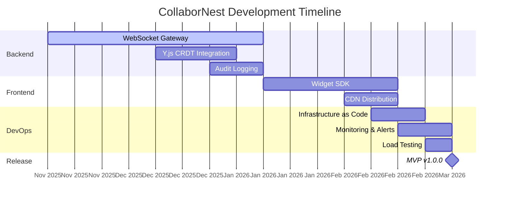

# CollaborNest - Product Roadmap

> **Last Updated**: November 16, 2025  
> **Version**: 1.0  
> **Status**: Active Development

---

## 📋 Overview

CollaborNest is a real-time collaboration platform for healthcare applications. This roadmap outlines our development timeline, milestones, and strategic priorities.

**Vision**: Transform any healthcare web application into a collaborative real-time system **without modifying source code**.

**Repository**: [GitHub - CollaborNest](https://github.com/your-org/collabornest)  
**Documentation**: See [`/docs/PROJECT.md`](./PROJECT.md) for complete technical specification

---

## 🎯 Strategic Goals

### Short-term (Q4 2025 - Q1 2026)

- ✅ Complete backend WebSocket Gateway (BE-001)
- ✅ Implement Y.js CRDT for conflict-free editing
- ✅ Production-ready infrastructure with monitoring
- 🔄 Release MVP v1.0.0

### Mid-term (Q2-Q3 2026)

- 📋 Frontend Collaboration Widget SDK (FE-001)
- 📋 CDN distribution with <150KB bundle
- 📋 Mobile SDK (React Native)
- 📋 FHIR/HL7 integration examples

### Long-term (Q4 2026+)

- 📋 Video/audio collaboration layer
- 📋 AI-powered collaboration suggestions
- 📋 Enterprise SSO and multi-tenancy
- 📋 HIPAA/SOC 2 certifications

---

## 📅 Detailed Timeline

---

## 🚀 Phase 1: Backend Foundation (Weeks 1-8)

**Timeline**: November 16, 2025 - January 10, 2026  
**Epic**: [BE-001: WebSocket Gateway Implementation](./EPIC-001-websocket-gateway.md)  
**Status**: 🔄 In Progress

### Milestones

| Week | Milestone             | Deliverable                                        | Status         |
| ---- | --------------------- | -------------------------------------------------- | -------------- |
| 1-2  | Connection Management | JWT auth, heartbeat, session handling              | 🔄 In Progress |
| 2-3  | Presence Tracking     | Resource rooms, join/leave events                  | 📋 Planned     |
| 3-4  | Distributed Locks     | Redis-backed locks, TTL, deadlock prevention       | 📋 Planned     |
| 4-6  | Y.js CRDT             | Conflict-free editing, state synchronization       | 📋 Planned     |
| 5-6  | RabbitMQ Broadcasting | Event pub/sub, multi-instance coordination         | 📋 Planned     |
| 6-7  | Audit Logging         | NDJSON format, PostgreSQL persistence              | 📋 Planned     |
| 7-8  | Error Handling        | Circuit breaker, retry logic, graceful degradation | 📋 Planned     |
| 8    | Load Testing          | 500+ concurrent users, <200ms P99 latency          | 📋 Planned     |

### Success Criteria

- [ ] WebSocket connection with JWT authentication
- [ ] Real-time presence tracking (join/leave events)
- [ ] Redis-backed distributed locks (< 5ms latency)
- [ ] Y.js document synchronization
- [ ] RabbitMQ event broadcasting across instances
- [ ] NDJSON audit logs with 10-year retention
- [ ] Load test: 500+ concurrent users with < 200ms P99 latency

---

## 🎨 Phase 2: Frontend Widget (Weeks 9-13)

**Timeline**: January 11, 2026 - February 14, 2026  
**Epic**: [FE-001: Collaboration Widget SDK](./EPIC-002-collaboration-widget.md)  
**Status**: 📋 Planned

### Milestones

| Week  | Milestone         | Deliverable                                                 | Status     |
| ----- | ----------------- | ----------------------------------------------------------- | ---------- |
| 9-10  | Auto-Discovery    | Detect input fields, initialize widget with 2 lines of code | 📋 Planned |
| 10-11 | Real-time UI      | Presence avatars, cursors, typing indicators                | 📋 Planned |
| 11-12 | Offline Support   | Queue management, sync on reconnect                         | 📋 Planned |
| 12-13 | CDN Distribution  | Webpack bundle, semver, global CDN deployment               | 📋 Planned |
| 13    | Integration Tests | Example apps (React, Vue, Angular, Vanilla JS)              | 📋 Planned |

### Success Criteria

- [ ] < 2 lines of code integration
- [ ] Auto-detect input fields (text, textarea, contenteditable)
- [ ] Real-time presence UI (avatars, cursors)
- [ ] Offline editing with sync queue
- [ ] Widget bundle < 150KB gzipped
- [ ] CDN deployment with semver
- [ ] Example apps for all major frameworks

---

## 🏗️ Phase 3: Production Infrastructure (Weeks 14-16)

**Timeline**: February 15, 2026 - March 7, 2026  
**Epic**: [DEVOPS-001: Production Infrastructure](./EPIC-003-production-infra.md)  
**Status**: 📋 Planned

### Milestones

| Week | Milestone              | Deliverable                               | Status     |
| ---- | ---------------------- | ----------------------------------------- | ---------- |
| 14   | Infrastructure as Code | Terraform scripts for AWS/GCP             | 📋 Planned |
| 14   | Blue-Green Deployment  | CI/CD pipeline with GitHub Actions        | 📋 Planned |
| 15   | Monitoring             | Prometheus + Grafana dashboards           | 📋 Planned |
| 15   | Load Testing           | Artillery scripts, 1000+ concurrent users | 📋 Planned |
| 16   | Disaster Recovery      | Backup strategy, recovery plan            | 📋 Planned |
| 16   | Security Hardening     | SSL/TLS, HIPAA compliance audit           | 📋 Planned |

### Success Criteria

- [ ] Terraform scripts for AWS/GCP deployment
- [ ] CI/CD with GitHub Actions (test → build → deploy)
- [ ] Blue-Green deployment with zero downtime
- [ ] Monitoring dashboards (latency, errors, throughput)
- [ ] Load test: 1000+ concurrent users
- [ ] Automated backups (PostgreSQL daily, Redis snapshots)
- [ ] Security audit passed (SSL, HIPAA compliance)

---

## 🔮 Future Quarters

### Q2 2026: Advanced Features

**Focus**: Scalability and Enterprise Features

- [ ] Advanced lock strategies (Redlock multi-instance)
- [ ] Analytics dashboard for collaboration metrics
- [ ] FHIR/HL7 integration examples
- [ ] Mobile SDK (React Native)
- [ ] Integration test Docker orchestration improvement
- [ ] E2E test coverage reporting

**Estimated Effort**: 12 weeks (3 months)

---

### Q3 2026: Multimedia Collaboration

**Focus**: Rich Media and User Experience

- [ ] Video/audio collaboration layer
- [ ] Advanced conflict resolution UI
- [ ] Multi-tenancy support
- [ ] Enterprise SSO integration (SAML, OAuth2)
- [ ] Accessibility improvements (WCAG 2.1 AA compliance)
- [ ] Internationalization (i18n) support

**Estimated Effort**: 16 weeks (4 months)

---

### Q4 2026: AI and Compliance

**Focus**: Intelligence and Certification

- [ ] AI-powered collaboration suggestions
- [ ] Historical playback of collaboration sessions
- [ ] Advanced analytics and reporting
- [ ] Compliance certifications:
  - [ ] HIPAA certification
  - [ ] SOC 2 Type II
  - [ ] GDPR compliance audit
- [ ] Performance benchmarking baseline

**Estimated Effort**: 20 weeks (5 months)

---

## 📊 Key Performance Indicators (KPIs)

### Technical Metrics

| Metric               | Target      | Current | Status         |
| -------------------- | ----------- | ------- | -------------- |
| Latency P99          | < 200ms     | TBD     | 🔄 In Progress |
| Uptime               | > 99.5%     | TBD     | 📋 Planned     |
| Max Concurrent Users | 500+        | TBD     | 📋 Planned     |
| Message Delivery     | > 99.9%     | TBD     | 📋 Planned     |
| Widget Load Time     | < 500ms     | TBD     | 📋 Planned     |
| Data Loss Events     | 0           | 0       | ✅ Target      |
| Time to Integration  | < 5 minutes | TBD     | 📋 Planned     |

### Business Metrics

| Metric                 | Target | Current | Status                  |
| ---------------------- | ------ | ------- | ----------------------- |
| GitHub Stars           | 100+   | 0       | 📋 First Public Release |
| Contributors           | 10+    | 1       | 📋 Planned              |
| Production Deployments | 5+     | 0       | 📋 Post v1.0.0          |
| Widget Downloads/Month | 1000+  | 0       | 📋 Post CDN Release     |

---

## 🎯 Dependencies and Blockers

### Current Blockers

- **IMPROVE-002**: CI/CD GitHub Actions activation (blocked: no GitHub credits)
  - **Impact**: Cannot automate testing in CI
  - **Workaround**: Manual local testing before commit
  - **Resolution**: Q1 2026 when credits available

### Critical Dependencies

1. **Infrastructure**: AWS/GCP account setup (Week 14)
2. **CDN**: Cloudflare or Fastly account (Week 12)
3. **Monitoring**: Prometheus/Grafana hosting (Week 15)
4. **SSL Certificates**: Let's Encrypt or commercial (Week 16)

---

## 🔄 Release Strategy

### Versioning

We follow **Semantic Versioning** (MAJOR.MINOR.PATCH):

- **MAJOR**: Breaking changes (e.g., 1.0.0 → 2.0.0)
- **MINOR**: New features (backward compatible) (e.g., 1.0.0 → 1.1.0)
- **PATCH**: Bug fixes (e.g., 1.0.0 → 1.0.1)

### Release Cadence

- **Alpha Releases**: Weekly (internal testing)
- **Beta Releases**: Bi-weekly (selected partners)
- **Stable Releases**: Monthly (after v1.0.0)

### Upcoming Releases

| Version | Target Date   | Scope                  | Status     |
| ------- | ------------- | ---------------------- | ---------- |
| v0.3.0  | December 2025 | WebSocket + Presence   | 📋 Planned |
| v0.4.0  | January 2026  | Y.js CRDT              | 📋 Planned |
| v0.5.0  | February 2026 | Widget SDK Alpha       | 📋 Planned |
| v1.0.0  | March 2026    | MVP Production Release | 📋 Planned |

---

## 🤝 Contributing

See [CONTRIBUTING.md](../../CONTRIBUTING.md) for development workflow and task selection process.

### How to Pick a Task

1. **Check GitHub Issues**: Browse [open issues](https://github.com/your-org/collabornest/issues) with `good first issue` or `help wanted` labels
2. **Read Epic Documentation**: Understand context in Epic files (EPIC-001.md, EPIC-002.md, etc.)
3. **Comment on Issue**: Express interest and ask questions
4. **Get Assignment**: Maintainer assigns issue to you
5. **Create Branch**: `git checkout -b feature/description`
6. **Submit PR**: Follow PR template and checklist

### Task Labels

- `good first issue` - Beginner-friendly tasks
- `help wanted` - Contributions welcome
- `epic` - Large multi-story features
- `story` - User-facing functionality
- `task` - Implementation work
- `bug` - Something broken
- `enhancement` - New feature

---

## 📞 Contact

- **Project Lead**: Antonio (aqwesome.cit.dev@gmail.com)
- **Security**: See [SECURITY.md](../../SECURITY.md)
- **Discussions**: GitHub Discussions (post v1.0.0)

---

**Legend**:

- ✅ Completed
- 🔄 In Progress
- 📋 Planned
- ⏸️ Blocked

**Next Review**: December 1, 2025
